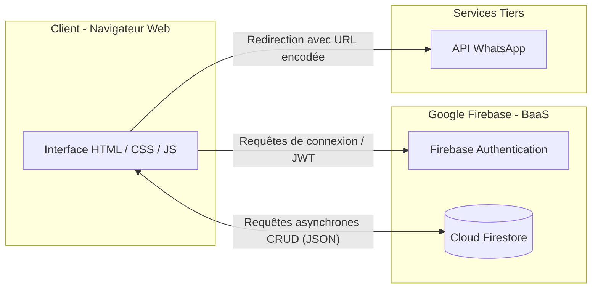
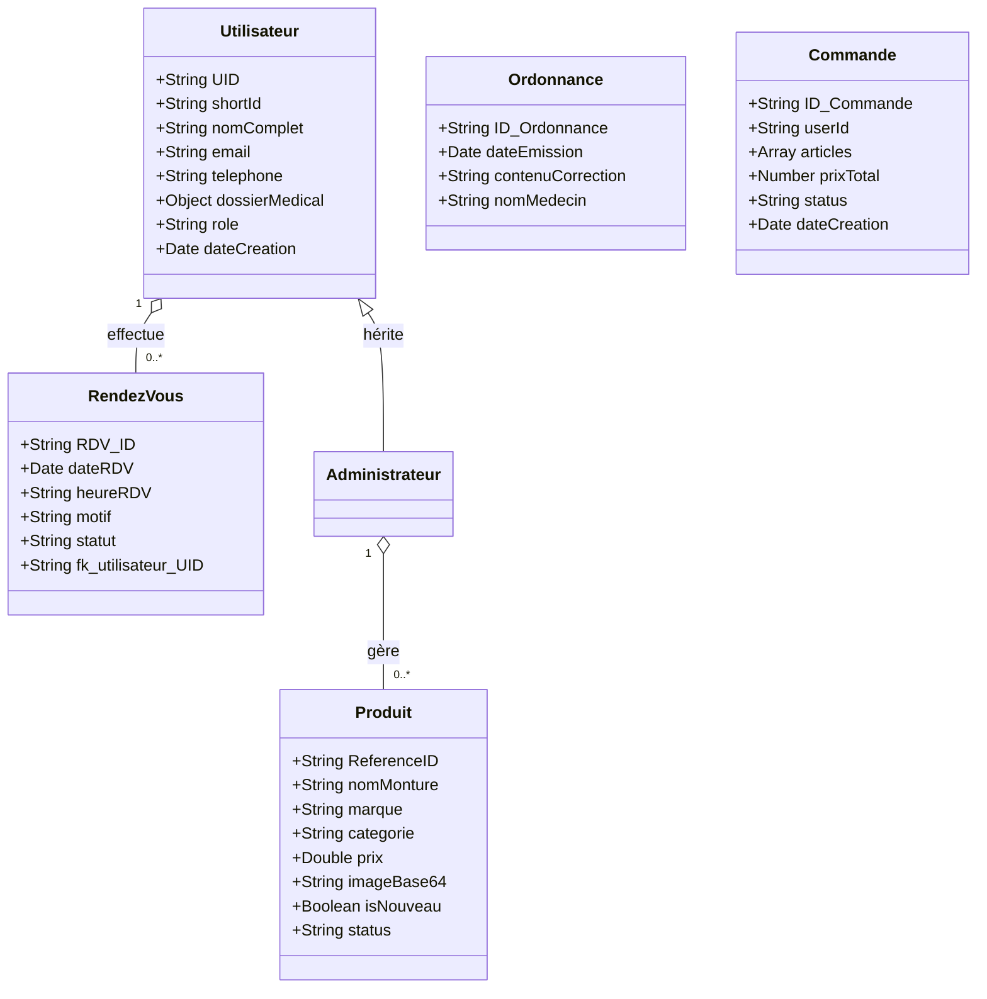
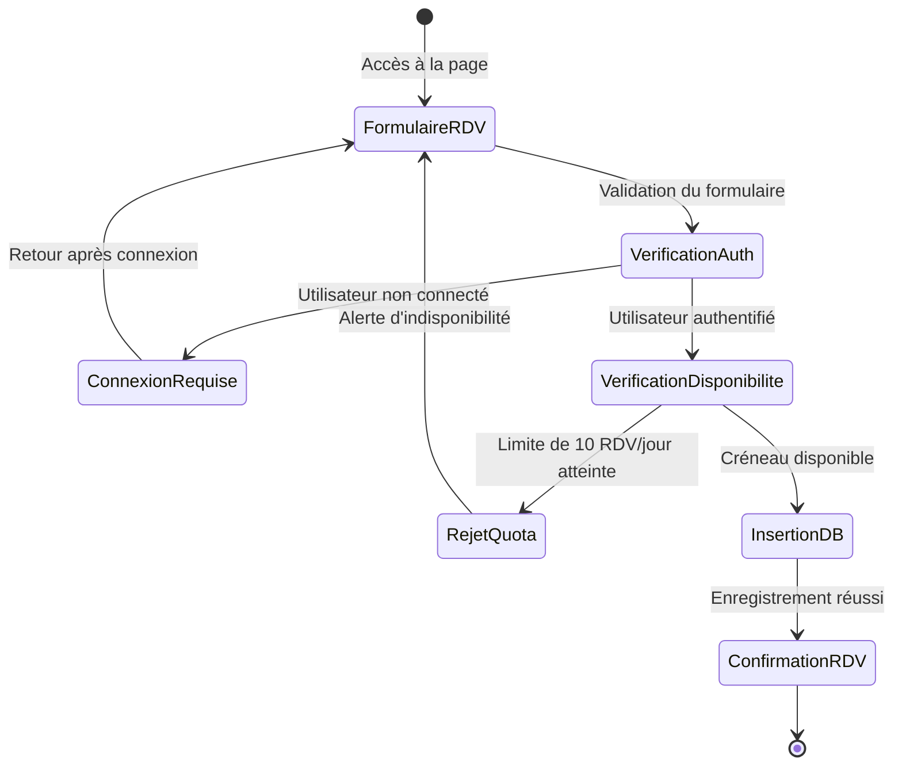
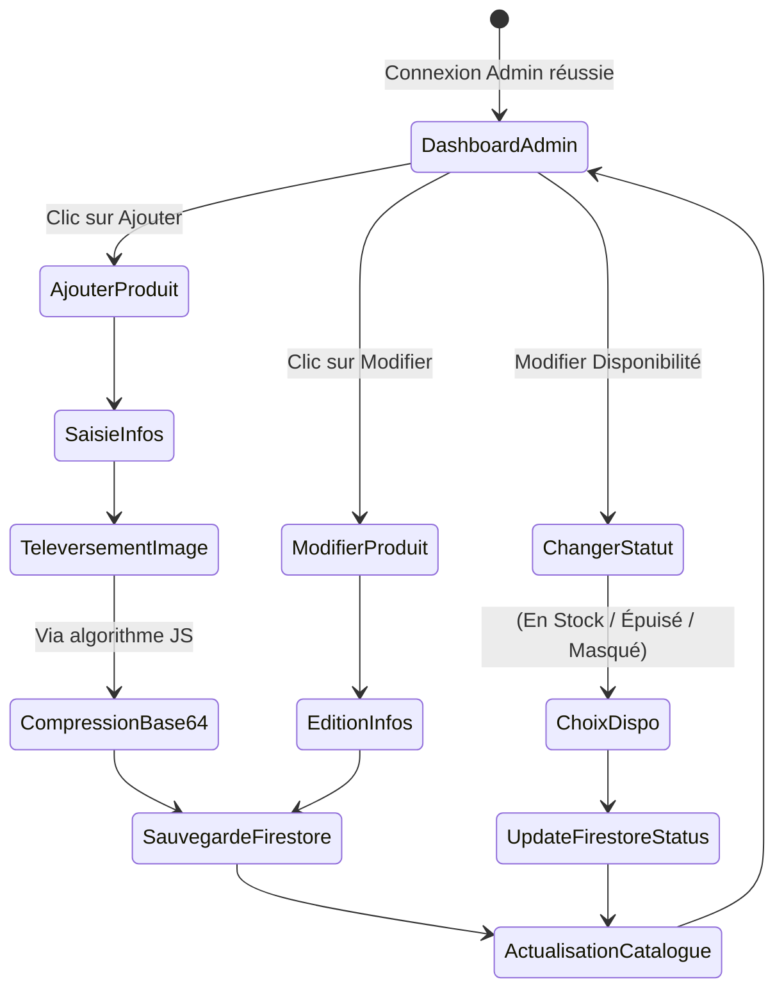
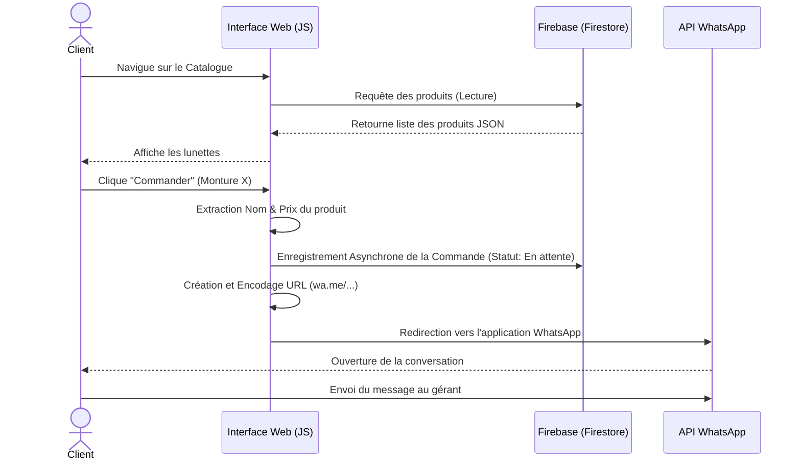

# DÉDICACES

Je dédie ce modeste travail de recherche à ma famille, pour leur soutien inconditionnel et leurs encouragements tout au long de mon parcours académique. Leurs sacrifices et leur confiance ont été le moteur de ma persévérance. À mes parents, dont la bienveillance a guidé chacun de mes pas.

---

# REMERCIEMENTS

Je tiens à exprimer ma profonde gratitude envers mon encadreur de mémoire pour ses conseils avisés, sa disponibilité et la justesse de ses orientations méthodologiques.
Mes remerciements s'adressent également à l'équipe de Barham Optic pour m'avoir ouvert ses portes et permis de travailler sur un cas réel, ainsi qu'à tout le corps professoral pour la qualité de l'enseignement reçu.

---

# RÉSUMÉ

L'intégration du numérique est aujourd'hui une nécessité stratégique pour toute entreprise, y compris dans le secteur de la santé visuelle. Ce mémoire retrace la conception et le développement d'une application web pour « Barham Optic », un cabinet d'optique traditionnel. Afin de pallier les limites de la gestion manuelle (engorgement des rendez-vous, visibilité réduite du catalogue), nous avons développé une plateforme web interactive. En nous appuyant sur les technologies HTML/CSS/JavaScript pour le Front-end et Google Firebase (BaaS) pour le Back-end, le système propose un catalogue dynamique avec filtres multicritères, un module de prise de rendez-vous avec gestion des quotas, un tunnel de commande innovant via l'API WhatsApp, ainsi qu'un outil CRM complet (Espace Médecin) gérant les dossiers patients avec identifiants courts et générant dynamiquement des ordonnances imprimables. Ce projet démontre l'impact positif de la digitalisation sur la relation client et l'optimisation administrative d'une PME.

---

# GLOSSAIRE

*   **BaaS (Backend as a Service)** : Modèle de service cloud où un prestataire fournit et gère l'infrastructure côté serveur (base de données, authentification).
*   **CRUD** : Acronyme pour Create, Read, Update, Delete. Ce sont les quatre opérations de base pour la persistance des données.
*   **Firestore** : Base de données NoSQL hébergée sur le cloud de Google Firebase.
*   **Front-end** : Partie de l'application web visible et interactive pour l'utilisateur.
*   **UML (Unified Modeling Language)** : Langage de modélisation graphique standardisé pour la conception logicielle.

---

# 🟦 SOMMAIRE

**Dédicaces** ........................................................................ i
**Remerciements** ............................................................... ii
**Résumé** ........................................................................... iii
**Glossaire** ......................................................................... iv
**Sommaire** ....................................................................... vii
**Liste des figures** .......................................................... viii
**Liste des tableaux** ....................................................... ix
**Liste des sigles** ............................................................ x

---

# LISTE DES FIGURES

*   **Figure 1 :** Architecture fonctionnelle (Serverless/BaaS) de l'application web Barham Optic
*   **Figure 2 :** Diagramme de cas d'utilisation global du système
*   **Figure 3 :** Diagramme de classes métier (Modélisation Firestore)
*   **Figure 4 :** Diagramme d'activité du processus de prise de rendez-vous en ligne
*   **Figure 5 :** Diagramme d'activité côté administrateur (Gestion CRUD)
*   **Figure 6 :** Diagramme de séquence du flux "Passer commande via WhatsApp"
*   **Figure 7 :** Interface de connexion et d'authentification utilisateur
*   **Figure 8 :** Tableau de bord administratif personnalisé
*   **Figure 9 :** Arborescence du projet web (HTML/CSS/JS) dans VS Code
*   **Figure 10 :** Extrait de code (JavaScript) pour l'algorithme de filtrage multicritères
*   **Figure 11 :** Extrait de code pour la compression Base64 des images (téléversement)
*   **Figure 12 :** Extrait de code de vérification des quotas de réservation avec Firebase
*   **Figure 13 :** Rendu d'exécution des tests dans la console développeur (DevTools)

---

## **INTRODUCTION GÉNÉRALE** .............................................. 1

---

# 🟪 PARTIE 1 – CADRE THÉORIQUE & MÉTHODOLOGIQUE

## **CHAPITRE I – CADRE THÉORIQUE** ....................... 4
1. Problématique ............................................................... 4
2. Objectifs de l’étude .................................................... 6
3. Hypothèses de recherche ........................................ 8
4. Pertinence du sujet .................................................. 10
5. Revue critique de la littérature ......................... 12

## **CHAPITRE II – CADRE MÉTHODOLOGIQUE** ............ 15
1. Méthode adoptée ...................................................... 15
2. Délimitation du champ de l’étude .................... 17
3. Techniques d’investigation ................................. 20
4. Échantillonnage ...................................................... 22
5. Difficultés rencontrées ......................................... 25

---

# 🟪 PARTIE 2 – CADRE ORGANISATIONNEL & CONCEPTUEL

## **CHAPITRE I – L’ORGANISATION (BARHAM OPTIC)** .... 29
1. Historique de l'entreprise ........................................ 29
2. Processus de gestion avant digitalisation ........... 31
3. Limites rencontrées .............................................. 34
4. Besoins identifiés ................................................. 37

## **CHAPITRE II – CADRE CONCEPTUEL** ................. 39
1. Concepts clés ......................................................... 39
2. Architecture fonctionnelle ................................. 42

---

# 🟪 PARTIE 3 – CADRE ANALYTIQUE

## **CHAPITRE I – CONCEPTION & DÉVELOPPEMENT** .... 60
1. Environnement de développement ................. 60
2. Modélisation des données : Collections Firebase .. 62
3. Vues et Templates : logique de présentation .... 63
4. Authentification et gestion des droits ............ 64
5. Tests fonctionnels ................................................. 65

## **CHAPITRE II – ANALYSE DES RÉSULTATS** .......... 68
1. Présentation des modules développés .......... 68
2. Test de chaque module ....................................... 70
3. Résultats observés ............................................... 71

## **CHAPITRE III – LIMITES & PERSPECTIVES** ......... 73
1. Limites ................................................................... 73
2. Perspectives d’amélioration ............................... 75
**Recommandations** .................................................... 77

---

# 🟪 CONCLUSION GÉNÉRALE
**Conclusion générale** ............................................... 79
**Bilan du projet** ....................................................... 79
**Valeur ajoutée pour Barham Optic** ................. 79
**Conclusion** ............................................................... 81

---

# 📚 **BIBLIOGRAPHIE** ............................................... 82

# 📎 **LISTE DES ANNEXES** ........................................ 83


---
---


# INTRODUCTION GÉNÉRALE

L’évolution fulgurante des Technologies de l'Information et de la Communication (TIC) a profondément bouleversé l’ensemble des secteurs d’activité à travers le monde. Aujourd'hui, l'intégration du numérique n'est plus perçue comme un simple avantage concurrentiel, mais plutôt comme une nécessité vitale pour la croissance des entreprises. Ce phénomène de transformation digitale a donné naissance au commerce électronique (e-commerce), abolissant les barrières géographiques.

Le secteur de l'optique et de la lunetterie n'échappe pas à cette révolution. Longtemps considéré comme limité aux points de vente physiques pour des raisons inhérentes aux essayages, il entame une transition technologique majeure. Les patients exigent désormais des processus simplifiés : prise de rendez-vous en ligne, consultation du catalogue à distance et parcours d'achat fluidifié.

C'est dans ce contexte que s'inscrit notre projet de fin d'études, axé sur la digitalisation des services de "Barham Optic", une entreprise de santé visuelle. Ce présent mémoire détaille la démarche scientifique, technique et organisationnelle qui a permis de transformer un modèle d'affaires traditionnel en une solution numérique innovante, robuste et adaptée aux réalités du marché actuel.

---

# 🟪 PARTIE 1 – CADRE THÉORIQUE & MÉTHODOLOGIQUE

## CHAPITRE I – CADRE THÉORIQUE

### 1. Problématique
Le fonctionnement de Barham Optic reposait jusqu'à présent sur un modèle manuel : accueil physique pour le choix des montures, appels téléphoniques pour les rendez-vous, et gestion sur support papier de la patientèle. Cette méthode révèle des failles : engorgements en boutique, rendez-vous mal synchronisés, manque de visibilité du catalogue en dehors du quartier, et charge administrative lourde. La problématique se pose ainsi : *Comment moderniser la gestion de Barham Optic, optimiser l'accueil des patients et accroître sa visibilité commerciale grâce aux outils du développement web ?*

### 2. Objectifs de l’étude
**Objectif Principal :** Concevoir, développer et déployer une plateforme web dynamique pour digitaliser les activités de Barham Optic.
**Objectifs Spécifiques :**
*   Digitaliser le catalogue (Verres, Collections, Solaires) avec un système de filtres.
*   Automatiser la prise de rendez-vous avec des quotas journaliers.
*   Intégrer un système de commande fluide via l'API WhatsApp.
*   Développer un espace d'administration (Dashboard) pour la gestion autonome des stocks.
*   Déployer un CRM Médical (Dossier Patient) permettant le suivi clinique, l'attribution d'identifiants courts et la génération d'ordonnances imprimables A4.

### 3. Hypothèses de recherche
*   **Hypothèse 1 :** La mise en place d'un catalogue digital interactif augmentera la visibilité des produits et stimulera le désir d'achat des clients distants.
*   **Hypothèse 2 :** L'automatisation des rendez-vous réduira significativement les temps d'attente en boutique et les erreurs de planification (surbooking).
*   **Hypothèse 3 :** L'intégration de WhatsApp comme canal de commande final renforcera la confiance du client tout en minimisant les coûts transactionnels pour l'entreprise.

### 4. Pertinence du sujet
Ce sujet revêt une double pertinence. D'un point de vue académique, il permet d'appliquer les concepts d'ingénierie logicielle et d'architecture Cloud (BaaS) sur un cas concret. D'un point de vue économique, il répond à un besoin urgent d'une PME locale de s'adapter aux standards numériques de consommation post-pandémie, garantissant ainsi sa pérennité.

### 5. Revue critique de la littérature
La littérature scientifique sur la e-santé et le e-commerce de détail démontre que l'omnicanalité est devenue le standard. Des études récentes prouvent que les patients privilégient les praticiens offrant des réservations en ligne. Néanmoins, la complexité des plateformes d'e-commerce complètes (avec paiement en ligne lourd) constitue souvent un frein pour les petites entreprises. D'où l'émergence du "Social Commerce" (via WhatsApp), particulièrement efficace et adapté au contexte africain et européen pour sa flexibilité.

---

## CHAPITRE II – CADRE MÉTHODOLOGIQUE

### 1. Méthode adoptée
Nous avons adopté une **méthodologie de développement Agile**, procédant par itérations (Sprints). Au lieu du modèle en cascade, nous avons développé le système par modules successifs : conception de l'UI (HTML/CSS), dynamisation du catalogue (JS), puis intégration du backend (Firebase). Cela a permis des validations intermédiaires rapides.

### 2. Délimitation du champ de l’étude
L'étude est circonscrite aux activités de "Barham Optic". Techniquement, la solution est strictement une **Application Web Responsive**. Le développement d'une application mobile native (iOS/Android) a été écarté car l'accessibilité via un simple navigateur mobile a été jugée plus pertinente pour l'acquisition de nouveaux clients.

### 3. Techniques d’investigation
*   **Entretiens semi-directifs :** Menés avec le gérant de Barham Optic pour comprendre ses processus quotidiens.
*   **Observation participative :** Séjours en boutique pour observer le parcours physique d'un patient, de l'entrée à l'achat.

### 4. Échantillonnage
Pour valider l'ergonomie, nous avons sollicité un échantillon de 15 personnes (clients habituels de Barham Optic et prospects) afin qu'ils testent les premières maquettes interactives. Leurs retours ont dicté le choix du design asymétrique (Lookbook) et la clarté du formulaire de rendez-vous.

### 5. Difficultés rencontrées
*   **La compression d'images côté client :** Pour éviter les coûts d'hébergement (Firebase Storage), il a fallu coder un algorithme JavaScript transformant les images en chaînes de caractères Base64 avant l'envoi en base de données.
*   **Les requêtes asynchrones :** La synchronisation parfaite entre les réponses du serveur (Promises Firebase) et l'affichage des éléments HTML sans créer de bugs d'affichage.

---

# 🟪 PARTIE 2 – CADRE ORGANISATIONNEL & CONCEPTUEL

## CHAPITRE I – L’ORGANISATION (BARHAM OPTIC)

### 1. Historique de l’entreprise
Barham Optic est un acteur de la santé visuelle reconnu pour son expertise technique et son conseil en visagisme. Originellement fondée sur un modèle de proximité, la boutique s'est bâtie une solide réputation de quartier grâce à la qualité de ses montures et à l'accompagnement personnalisé de ses patients.

### 2. Processus de gestion avant digitalisation
Historiquement, la réservation d'examens de vue se faisait par téléphone ou passage en boutique, consignée dans un agenda physique. La présentation des montures dépendait du stock physiquement disponible en rayon. Le réassort et le suivi des ventes s'effectuaient sur de simples tableurs Excel déconnectés.

### 3. Limites rencontrées
*   **Limites opérationnelles :** Perte de temps administratif, erreurs de double réservation, difficulté à retrouver l'historique d'achat d'un patient.
*   **Limites commerciales :** Zone de chalandise restreinte à la seule rue de la boutique. Impossibilité pour un client de voir les nouveautés sans se déplacer.

### 4. Besoins identifiés
L'organisation a exprimé le besoin absolu d'une **vitrine virtuelle connectée**. Il lui fallait une interface publique premium pour ses produits, un outil privé d'administration pour la gestion de l'inventaire en temps réel, et un calendrier digital partagé et sécurisé.

---

## CHAPITRE II – CADRE CONCEPTUEL

### 1. Concepts clés
*   **Responsive Web Design :** Capacité du site à s'adapter techniquement à toutes les tailles d'écrans (Mobiles, Tablettes, PC).
*   **Architecture Serverless :** Délégation de la gestion des serveurs physiques à un fournisseur tiers (Google) pour se concentrer sur le code métier.
*   **Authentification JWT :** Méthode de sécurisation des sessions utilisateurs via des jetons chiffrés.

### 2. Architecture fonctionnelle
L'architecture de Barham Optic est découpée en deux niveaux :
*   **Le Front-end (Navigateur Client) :** Contient la logique d'interface en HTML5, CSS3 et JavaScript. Il gère l'UX (Design, animations) et l'UI.
*   **Le Back-end (Google Firebase) :** Agit comme Backend-as-a-Service. Il héberge la base de données (Firestore) et gère le système de sécurité (Firebase Authentication) protégeant le Dashboard Admin.

**Figure 1 : Architecture fonctionnelle (Serverless/BaaS) de l'application web Barham Optic**


### 3. Modélisation globale du système
Pour illustrer les interactions entre les utilisateurs (Clients et Administrateur) et les différentes fonctionnalités de la plateforme, nous avons modélisé le diagramme de cas d'utilisation suivant :

**Figure 2 : Diagramme de cas d'utilisation global du système**
```mermaid
flowchart LR
    Client((Client))
    Admin((Administrateur))
    
    subgraph "Système Web Barham Optic"
        direction TB
        uc1([Consulter le catalogue])
        uc2([Filtrer les produits])
        uc3([Simulateur Avant/Après])
        uc4([S'inscrire / Se connecter])
        uc5([Prendre un rendez-vous])
        uc6([Commander (WhatsApp & Historique)])
        uc7([Gérer le catalogue CRUD])
        uc8([Gérer RDV et Dossiers Médicaux])
        uc9([Générer / Imprimer Ordonnances])
        uc10([Gérer / Valider les Commandes])
    end
    
    Client --> uc1
    Client --> uc2
    Client --> uc3
    Client --> uc4
    Client --> uc5
    Client --> uc6
    Client --> uc9
    
    uc5 -. "<<include>>" .-> uc4
    uc6 -. "<<extend>>" .-> uc4
    uc9 -. "<<include>>" .-> uc4
    
    Admin --> uc4
    Admin --> uc7
    Admin --> uc8
    Admin --> uc9
    Admin --> uc10
```

---

# 🟪 PARTIE 3 – CADRE ANALYTIQUE

## CHAPITRE I – CONCEPTION & DÉVELOPPEMENT

### 1. Environnement de développement
Le projet a été développé sous l'éditeur de code **Visual Studio Code**, avec **Git** pour le contrôle de version. Les navigateurs modernes (Chrome DevTools) ont été utilisés pour tester la réactivité (Responsive) en direct.

### 2. Modélisation des données : Collections Firebase
Plutôt que des tables SQL ou des modèles Django classiques, le système NoSQL Firebase utilise des **Collections** de **Documents** (format JSON) :
*   **Collection `Produits` :** Contient les informations (Marque, Catégorie, Prix, Image Base64).
*   **Collection `Rendez-vous` :** Contient la date, l'heure, le motif et l'ID de l'utilisateur.
*   **Collection `Utilisateurs` :** Contient les profils des patients (géré par Auth).

**Figure 3 : Diagramme de classes métier (Modélisation Firestore)**


### 3. Vues et Templates : logique de présentation
La logique de présentation repose sur la manipulation du **DOM (Document Object Model)** par JavaScript. Par exemple, au chargement de `collections.html`, un script récupère les données JSON depuis Firestore et génère dynamiquement des cartes HTML (`<div>` contenant image et texte) pour chaque lunette. Des règles CSS avancées (Grid, Flexbox, Masonry) assurent un affichage haut de gamme.

### 4. Authentification et gestion des droits
**Firebase Authentication** gère la sécurité. Un visiteur ne peut prendre rendez-vous sans se connecter (par Email ou Google Sign-In). De plus, des *Security Rules* strictes sont paramétrées en base de données : seul l'UID (User ID) de l'administrateur est autorisé à écrire ou supprimer des données dans la collection `Produits`.

### 5. Tests fonctionnels
Des tests unitaires manuels ont été menés :
*   Test du formulaire de RDV : Validation des champs obligatoires et interdiction de choisir une date passée.
*   Test de quota : Tentative de création de 11 rendez-vous le même jour. Le système a correctement bloqué à 10 requêtes.
*   Test d'accès : Tentative de connexion au Dashboard sans compte admin (rejet sécurisé immédiat).

---

## CHAPITRE II – ANALYSE DES RÉSULTATS

### 1. Présentation des modules développés
*   **La Vitrine Interactive :** Les pages Collections et Verres intègrent des filtres rapides (Homme/Femme) et des démonstrateurs visuels innovants (simulation avant/après des traitements de verres via CSS).
*   **Le Module de Rendez-vous :** Interface épurée permettant au patient connecté de bloquer un créneau horaire en 3 clics.
*   **Le CRM Patient & Ordonnances :** Un espace "Médecin" dédié pour renseigner un dossier médical structuré (11 sections). Le système génère automatiquement un N° de dossier court (recherche instantanée) et produit des ordonnances A4 imprimables, accessibles également depuis le profil du patient.

**Figure 4 : Diagramme d'activité du processus de prise de rendez-vous en ligne**


*   **Le Dashboard d'Administration :** Espace CRUD (Create, Read, Update, Delete/Status) où le gérant peut ajouter une nouvelle monture avec compression d'image intégrée, gérer l'affichage public grâce au *Statut de disponibilité* (En stock, Rupture, Masqué) et suivre l'agenda avec des boutons d'actions ergonomiques.

**Figure 5 : Diagramme d'activité côté administrateur (Gestion CRUD & Statuts)**


### 2. Test de chaque module
Le déploiement via **Vercel** a permis de valider le comportement de la plateforme en ligne (Production). La génération de liens WhatsApp pré-remplis pour les commandes de produits fonctionne sans faille et fait le pont directement vers le téléphone de l'opticien.

**Figure 6 : Diagramme de séquence du flux "Passer commande via WhatsApp"**


### 3. Résultats observés
La plateforme offre une réactivité impressionnante (architecture Single Page like grâce à l'appel asynchrone JavaScript). L'absence de rechargement complet des pages lors des filtrages multicritères offre une expérience utilisateur fluide, retenant l'attention du visiteur.

---

## CHAPITRE III – LIMITES & PERSPECTIVES

### 1. Limites
La principale limite réside dans la transaction financière finale. L'usage de WhatsApp, bien que pratique pour la prise de contact, n'est pas un système de paiement électronique automatisé. De plus, la plateforme ne permet pas l'essai virtuel (Virtual Try-On).

### 2. Perspectives d’amélioration
*   **Intégration bancaire :** Connecter une API de paiement (Stripe ou Mobile Money local) pour automatiser la facturation.
*   **Réalité Augmentée (AR) :** Intégrer une librairie de reconnaissance faciale en JavaScript pour permettre au client de superposer les montures sur son visage via la webcam de son téléphone.

### 3. Recommandations
Pour tirer pleinement profit de la solution, il est recommandé d'organiser une formation du personnel de boutique à l'utilisation du Dashboard. Par ailleurs, Barham Optic devrait lancer une campagne de marketing digital ciblée (Réseaux Sociaux) en utilisant le lien de la nouvelle plateforme comme appel à l'action.

---

# 🟪 CONCLUSION GÉNÉRALE

**Bilan du projet**
Ce mémoire a documenté la transition numérique réussie de Barham Optic. En partant de processus manuels limitants, nous avons conceptualisé et développé un système d'information web complet. Le choix d'une architecture moderne (JavaScript natif couplé à la base de données cloud Firebase) s'est avéré pertinent, alliant performance d'affichage et sécurité des données.

**Valeur ajoutée pour Barham Optic**
La valeur ajoutée est immédiate : l'entreprise dispose désormais d'un outil de rayonnement qui n'est plus limité par les murs de sa boutique. Le gain de temps administratif généré par l'agenda automatisé et le processus de commande via WhatsApp permet à l'opticien de se reconcentrer sur son cœur de métier : la santé visuelle et le conseil. 

**Conclusion**
Le commerce électronique et la digitalisation de la santé ne sont plus des tendances, mais les fondations de l'entreprise de demain. Ce projet de fin d'études prouve que, grâce à des outils web modernes et à une ingénierie agile, il est possible de doter une structure traditionnelle d'outils dignes des grands réseaux, et ce, de manière économiquement viable. Ce portail numérique pose les bases d'une croissance renouvelée pour Barham Optic.

---

# 📚 BIBLIOGRAPHIE

1. **Google Firebase Documentation Officielle**, Guides sur Firestore, Authentication et Security Rules. URL: https://firebase.google.com/docs
2. **MDN Web Docs (Mozilla Developer Network)**, Référence incontournable pour le JavaScript asynchrone, CSS Grid et HTML5. URL: https://developer.mozilla.org
3. **WhatsApp Business API Reference**, Guide de structuration de liens `wa.me` pour l'intégration e-commerce.
4. **Roques, P. (2018)**. *UML 2 par la pratique : Études de cas et exercices corrigés*. Éditions Eyrolles.

---

# 📎 LISTE DES ANNEXES

*   **Annexe 1 :** Maquettes initiales (Wireframes) de la plateforme Barham Optic.
*   **Annexe 2 :** Diagramme des Cas d'Utilisation UML global.
*   **Annexe 3 :** Captures d'écran du Dashboard Administrateur en production.
*   **Annexe 4 :** Extraits de code de la compression Base64 des images.
*   **Annexe 5 :** Questionnaire d'enquête soumis à l'échantillon d'utilisateurs.
