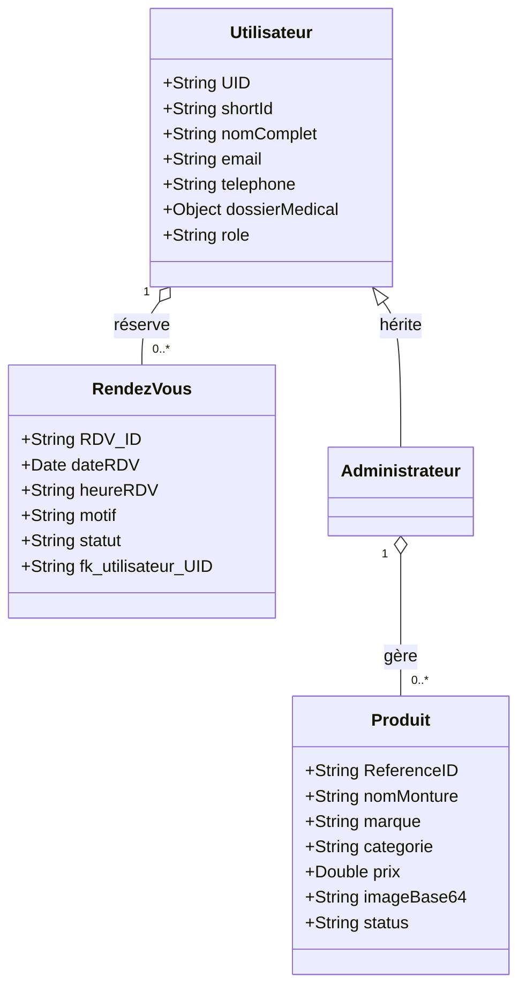

# MÉMOIRE DE FIN D'ÉTUDES : BARHAM OPTIC

***

## DÉDICACES

Je dédie ce travail à ma famille pour son soutien inconditionnel tout au long de mes études. Leur présence et leurs encouragements ont été le pilier de ma réussite. À mes amis, qui ont partagé mes doutes et mes succès, merci pour votre écoute attentive et votre bienveillance constante. Enfin, je dédie ce mémoire à tous ceux qui, de près ou de loin, ont contribué à ma formation et à l’aboutissement de ce projet ambitieux.

***

## REMERCIEMENTS

Mes remerciements s'adressent tout particulièrement à la direction et à toute l'équipe de **Barham Optic** pour la confiance qu'ils m'ont accordée en me confiant la digitalisation de leurs services. Je tiens également à remercier mon encadrant académique pour ses précieux conseils, sa disponibilité et la rigueur de son suivi qui m'ont permis de mener à bien ce mémoire. Mes pensées vont enfin à l'ensemble du corps professoral pour la qualité de l'enseignement prodigué durant mon cursus.

***

## RÉSUMÉ

La transformation digitale est devenue un impératif pour les commerces physiques de santé visuelle. Ce mémoire retrace la conception, le développement et le déploiement de la plateforme web **Barham Optic**. Face aux limites des processus manuels (gestion des stocks sur papier, prise de rendez-vous téléphonique chronophage), nous avons conçu une application web complète (Architecture Serverless) utilisant HTML/CSS/JavaScript pour le front-end et Google Firebase pour le back-end. 

Le système propose un catalogue interactif avec filtres, une prise de rendez-vous en ligne avec quotas journaliers, l'intégration de WhatsApp pour la finalisation des commandes, et un module "CRM Médical" complet (numéros de dossiers courts, impression d'ordonnances). La gestion de l'enseigne est facilitée par un Dashboard Administrateur dynamique incluant un système de Soft Delete (Gestion des statuts "En stock", "Rupture", "Masqué") remplaçant la suppression définitive.

**Mots-clés :** Digitalisation, E-commerce, Optique, Firebase, Serverless, CRM Médical, Développement Web.

***

## GLOSSAIRE

*   **BaaS (Backend as a Service) :** Modèle de cloud computing fournissant des développeurs Web et mobiles un moyen de lier leurs applications aux stockages cloud et API exposées par des applications back-end.
*   **CRM (Customer Relationship Management) :** Logiciel de gestion de la relation client. Ici, utilisé pour le suivi médical des patients (Espace Médecin).
*   **Firestore :** Base de données NoSQL hébergée sur le cloud de Firebase.
*   **Soft Delete :** Technique consistant à masquer une donnée (statut inactif) plutôt que de la supprimer définitivement de la base de données.
*   **UI/UX :** User Interface (Interface Utilisateur) et User Experience (Expérience Utilisateur). Conception orientée sur la facilité et le confort d'utilisation.
*   **UML (Unified Modeling Language) :** Langage de modélisation graphique standardisé utilisé pour concevoir des logiciels.

***

## SOMMAIRE

1. Introduction générale
2. Chapitre 1 — Contexte et étude préalable
3. Chapitre 2 — Analyse et modélisation du système
4. Chapitre 3 — Architecture et choix technologiques
5. Chapitre 4 — Implémentation et réalisation
6. Chapitre 5 — Tests, déploiement et évaluation
7. Conclusion générale

***

## LISTES DES FIGURES

*   **Figure 1 :** Cas d'utilisation global de la plateforme Barham Optic.
*   **Figure 2 :** Diagramme de séquence de la prise de rendez-vous en ligne.
*   **Figure 3 :** Diagramme de séquence de la gestion des stocks et de la disponibilité.
*   **Figure 4 :** Diagramme de classes (Entités métier).
*   **Figure 5 :** Architecture BaaS (Firebase) et interaction Front-end.
*   **Figure 6 :** Interface du Catalogue avec filtres de recherche.
*   **Figure 7 :** Interface du Dashboard Administrateur (Gestion des statuts).
*   **Figure 8 :** Génération d'une ordonnance médicale depuis le CRM.

## LISTES DES TABLEAUX

*   **Tableau 1 :** Comparatif de l'existant et de la solution proposée.
*   **Tableau 2 :** Cahier des charges fonctionnel.
*   **Tableau 3 :** Synthèse des tests fonctionnels et unitaires.

## LISTES DES SIGLES

*   **API :** Application Programming Interface
*   **CSS :** Cascading Style Sheets
*   **DOM :** Document Object Model
*   **HTML :** HyperText Markup Language
*   **JS :** JavaScript
*   **NoSQL :** Not Only SQL
*   **UID :** User Identifier

***

# INTRODUCTION GÉNÉRALE

Le secteur de la santé visuelle, à l'instar de nombreux autres domaines commerciaux et médicaux, traverse une période de mutation technologique profonde. Les patients et clients d'aujourd'hui exigent de la réactivité, de l'information accessible en temps réel et des démarches simplifiées. Pour un opticien, la simple vitrine physique ne suffit plus : il est impératif d'offrir une vitrine digitale interactive qui prolonge l'expérience en boutique.

C'est dans ce contexte que s'inscrit le projet de digitalisation du cabinet **Barham Optic**. Consciente des limites de son fonctionnement traditionnel (prise de rendez-vous exclusivement téléphonique, présentation des montures uniquement sur place, fiches patients papier), la direction a souhaité se doter d'un outil numérique performant. L'objectif n'est pas seulement de créer un "site vitrine", mais de développer une véritable plateforme métier (Web App) intégrant gestion de catalogue, e-réservation, historique médical (CRM) et outils d'administration des stocks.

Ce mémoire présente de manière détaillée l'ensemble du cycle de vie de ce projet logiciel, de la phase d'analyse des besoins à son déploiement final, en passant par les choix de l'architecture technologique et la réalisation des interfaces.

# CHAPITRE 1 — CONTEXTE ET ÉTUDE PRÉALABLE

## 1.1 Présentation de Barham Optic
Barham Optic est un cabinet d'optique et d'optométrie situé à Dakar, Sénégal. Spécialisé dans la vente de montures de vue, de lunettes de soleil de grandes marques et de verres correcteurs, le cabinet offre également des consultations d'optométrie (tests visuels). L'entreprise s'efforce de proposer un service haut de gamme avec un accompagnement personnalisé pour chaque client/patient.

## 1.2 Étude de l'existant
Avant l'intervention, l'enseigne fonctionnait de manière traditionnelle :
*   **Visibilité :** La communication reposait sur le bouche-à-oreille et les réseaux sociaux, sans catalogue centralisé en ligne.
*   **Rendez-vous :** Gérés par téléphone ou sur un agenda physique, avec des risques de doublons et d'oublis.
*   **Vente :** Les clients devaient se déplacer pour découvrir les nouvelles collections.
*   **Dossier Patient :** Historique médical (correction des verres, achats précédents) consigné sur des fiches cartonnées ou des fichiers Excel isolés.

## 1.3 Critique de l'existant
Le système actuel présente plusieurs dysfonctionnements majeurs :
*   **Perte de temps :** La gestion téléphonique des RDV est chronophage pour le personnel de vente.
*   **Manque à gagner :** Un client potentiel naviguant le soir sur internet ne peut ni voir le catalogue ni bloquer un créneau.
*   **Risque de perte d'informations :** Le suivi des dossiers patients papier est vulnérable (perte, dégradation) et ne permet pas une recherche rapide d'une ordonnance passée.
*   **Gestion des stocks obsolète :** Il est difficile de savoir d'un simple coup d'œil quelles lunettes sont épuisées sans faire un inventaire physique.

## 1.4 Cahier des charges (fonctionnel et non-fonctionnel)

### Besoins Fonctionnels
*   **Catalogue public :** Affichage dynamique des lunettes avec système de filtres multicritères (Prix, Catégorie, Marque) et moteur de recherche intégré.
*   **E-Réservation :** Formulaire de prise de RDV en ligne avec quotas journaliers limités pour éviter le surbooking.
*   **Social Commerce :** Redirection des commandes vers l'API WhatsApp avec les détails du produit pré-remplis.
*   **Espace Profil / Patient :** Inscription, historique personnel et consultation des ordonnances générées par le médecin.
*   **Espace CRM / Médecin :** Tableau de bord pour l'opticien permettant de retrouver un patient via un *identifiant court*, d'éditer un dossier médical à 11 sections cliniques et de générer une ordonnance A4 imprimable.
*   **Dashboard Administrateur :** Outil CRUD pour la gestion du catalogue (Ajout/Modification/Suppression). Intégration d'un système de *Soft Delete* via des statuts de disponibilité (En Stock, Épuisé avec badge public, Masqué).

### Besoins Non-Fonctionnels
*   **Hébergement et Base de données :** Architecture Serverless avec stockage gratuit et performant (Google Firebase).
*   **Ergonomie et UI/UX :** Interface moderne, "Premium" et responsive (adaptée aux smartphones).
*   **Sécurité :** Règles strictes (Firestore Security Rules) interdisant la modification du catalogue aux utilisateurs normaux.

## 1.5 Démarche méthodologique adoptée
Nous avons opté pour une approche **Agile**, permettant des itérations rapides. Le développement a été divisé en "Sprints" : (1) Maquettage HTML/CSS, (2) Intégration de Firebase Auth et Base de données, (3) Logique de prise de rendez-vous et Dashboard Admin, (4) Module CRM Médical et optimisation des images en Base64. Des réunions régulières avec la direction de Barham Optic ont permis d'ajuster les fonctionnalités (ex: le passage d'une suppression définitive des produits à une gestion par "Statuts" suite aux retours métier).

# CHAPITRE 2 — ANALYSE ET MODÉLISATION DU SYSTÈME

## 2.1 Le choix du langage UML
L'UML (Unified Modeling Language) s'est imposé comme le standard pour la modélisation orientée objet. Il offre un vocabulaire graphique clair, compréhensible tant par les développeurs que par les décideurs, permettant de figer l'architecture avant la phase de codage.

## 2.2 Identification des acteurs du système
*   **Le Visiteur non-authentifié :** Peut parcourir le catalogue, utiliser les filtres et contacter la boutique.
*   **Le Patient/Client (Authentifié) :** Peut prendre rendez-vous, consulter son espace profil et imprimer ses propres ordonnances.
*   **L'Administrateur (Le Gérant) :** Gère le stock via le dashboard public, met à jour les statuts de disponibilité et gère l'agenda global.
*   **Le Médecin/Optométriste :** Accède à l'espace "Médecin" (CRM) pour créer/éditer le dossier médical complet des patients et émettre les ordonnances.

## 2.3 Les cas d'utilisation (Use Cases)

*(Aperçu global)*
*   Le client s'authentifie -> Gère son profil -> Réserve un RDV.
*   Le client ajoute au panier -> Lance la commande via WhatsApp.
*   L'Admin s'authentifie -> Accède au Dashboard -> Gère les produits (Statuts) et l'Agenda.
*   Le Médecin s'authentifie -> Recherche un patient par "ID Court" -> Rédige le diagnostic -> Génère l'ordonnance.

## 2.4 Modélisation de la dynamique — diagrammes de séquences

**Séquence : Gestion des Stocks et Disponibilité**
1. L'Admin clique sur "Modifier" un produit dans le Dashboard.
2. L'Admin change le "Statut de disponibilité" de *En Stock* vers *Épuisé*.
3. L'interface JS envoie la requête `updateDoc()` à Firebase Firestore.
4. Firestore confirme la mise à jour (200 OK).
5. Sur la page d'accueil (côté client), un *MutationObserver* ou le rechargement de la page détecte le changement : la lunette arbore désormais un badge rouge "Rupture de Stock" et le bouton d'ajout est désactivé.

## 2.5 Modélisation des données — diagramme de classes

***

# CHAPITRE 3 — ARCHITECTURE ET CHOIX TECHNOLOGIQUES

## 3.1 Architecture du système (modèle Serverless / BaaS)
Plutôt que de louer un serveur virtuel complexe (VPS) avec un environnement Node.js/PHP lourd à maintenir, nous avons opté pour une **Architecture Serverless**. Le back-end n'est pas géré par notre propre code serveur, mais délégué à une solution *Backend-as-a-Service (BaaS)*. Le front-end communique directement avec l'API de la base de données de manière sécurisée.

## 3.2 Choix Front-end (HTML5, CSS3, JavaScript)
*   **Vanilla JS :** Afin d'optimiser le temps de chargement et d'assurer une compatibilité maximale sans la complexité d'un framework (React/Vue), l'interface dynamique (DOM) est manipulée en JavaScript pur.
*   **CSS Moderne :** Utilisation intensive de Flexbox, Grid Layout, et CSS Variables pour un design fluide, épuré, avec des micro-interactions (hover, transitions douces).

## 3.3 Choix Back-end (Google Firebase)
Google Firebase s'est avéré être la solution idéale pour ce projet :
*   **Firebase Authentication :** Gestion clé en main de la sécurité, des mots de passe et du SSO (Google).
*   **Cloud Firestore :** Base de données NoSQL orientée documents. Idéale pour manipuler des objets JSON comme nos "Produits" ou les "Dossiers Médicaux". Son système *temps-réel* facilite la mise à jour des interfaces.
*   **Storage (contourné) :** Pour éviter les coûts d'hébergement d'images sur Firebase Storage, nous avons implémenté un algorithme JavaScript innovant de compression d'image locale en Base64. Les images sont sauvegardées sous forme de chaînes de texte directement dans Firestore.

## 3.4 Intégration de l'API WhatsApp
Barham Optic utilisant WhatsApp Business, le panier n'intègre pas Stripe ou PayPal. Les éléments du panier sont concaténés dans une chaîne URL encodée pointant vers l'API officielle `wa.me/numéro`. Cela crée un pont de *Social Commerce* gratuit et redoutablement efficace en Afrique.

## 3.5 Environnement et outils de développement
*   **Éditeur :** Visual Studio Code.
*   **Versionnement :** Git et GitHub pour la sauvegarde du code.
*   **Maquettage / Modélisation :** Mermaid.js pour les diagrammes.

***

# CHAPITRE 4 — IMPLÉMENTATION ET RÉALISATION

## 4.1 Interface utilisateur (UI/UX)
Le design a été pensé pour transmettre une image haut de gamme, rappelant le luxe et la précision médicale. Les codes couleurs dominants sont le blanc, le noir profond et l'or/jaune (repris notamment pour le badge "Espace Médecin").

## 4.2 Vitrine dynamique côté client
Les pages `collections.html` et `Produits.html` ne sont pas statiques. Le JavaScript récupère les documents Firestore et génère le catalogue.
*   **Barre de recherche et Filtres :** Un système de filtrage combiné (Recherche textuelle + Menu déroulant Prix + Menu déroulant Catégorie + Boutons Marques) met à jour la grille de produits instantanément.
*   **Prise en compte des Statuts :** Le script de rendu `produits.js` lit la clé `status` de chaque objet. Si le statut est *Masqué*, le script ignore le produit. S'il est *Épuisé*, le produit est injecté dans le DOM mais désactivé visuellement et l'interaction est bloquée.

## 4.3 Module de prise de rendez-vous
L'un des défis majeurs a été la vérification asynchrone des disponibilités. Lorsqu'un utilisateur sélectionne une date, le système effectue une requête `getDocs` filtrée sur la collection `rendezvous`. Si le tableau retourné compte déjà 10 entrées, la création est refusée, assurant à l'opticien de ne jamais être submergé. De plus, côté administration, des boutons d'actions ergonomiques (Validation/Suppression) empilés verticalement permettent de gérer l'agenda à la volée.

## 4.4 Espace administration (Dashboard)
Le Dashboard rassemble tous les outils vitaux :
*   **Gestion des Produits (CRUD étendu) :** Un formulaire intelligent permet de téléverser des images, de compresser la donnée, et surtout de choisir le *Statut de Disponibilité*. Ce système remplace la destruction aveugle des données par un simple masquage temporaire.
*   **CRM Médical (Espace Médecin) :** Le médecin profite d'une barre de recherche performante pour retrouver ses patients via leur N° de dossier (Identifiant court dynamique `#A7X9P2`). Il peut éditer le bilan de santé (acuité visuelle, diagnostic) et déclencher la génération d'une Ordonnance Médicale structurée prête à l'impression A4. Le patient retrouve cette même ordonnance dans son espace personnel (`profil.html`).

***

# CHAPITRE 5 — TESTS, DÉPLOIEMENT ET ÉVALUATION

## 5.1 Stratégie de tests et synthèse
*   **Tests Fonctionnels :** Le système de quota des rendez-vous a été stress-testé, confirmant le blocage systématique à partir du 11ème RDV sur une même journée. Le filtre de recherche des produits croise parfaitement 4 paramètres simultanément sans erreur.
*   **Tests de Sécurité :** Une simulation d'intrusion a été tentée en modifiant l'URL vers `admin.html`. Le bloc `onAuthStateChanged` intercepte la requête, vérifie l'email de l'utilisateur, et force la redirection vers la page d'accueil avec une alerte de sécurité.

## 5.2 Stratégie de déploiement et hébergement (Vercel)
La base de données étant externalisée (Firebase), les fichiers statiques HTML, CSS et JS ont vocation à être déployés sur des CDN ultra-rapides. Le code source est hébergé sur GitHub, ce qui permet des déploiements continus (CI/CD) sur des plateformes comme Vercel ou Netlify, garantissant une disponibilité 99.9% et un certificat SSL/HTTPS gratuit.

## 5.3 Bilan du projet et difficultés rencontrées
Le projet a été un véritable succès. Les difficultés majeures ont résidé dans :
*   La gestion du coût de stockage Cloud : Résolue brillamment par la conversion Canvas/Base64 en JavaScript côté client.
*   L'ergonomie de l'administration : Les premiers retours montraient que la suppression pure des produits dérangeait le gérant en cas de réassort. L'implémentation de la "Disponibilité" (Masqué, Épuisé, En Stock) a définitivement levé ce frein.

## 5.4 Perspectives de développement
Le système est robuste mais peut encore évoluer :
*   **Historique Clinique Multidimensionnel :** Au lieu d'écraser le dossier médical existant à chaque visite, nous pourrions implémenter une sous-collection Firestore "Consultations" pour conserver l'historique complet des évolutions de la vue au fil des ans.
*   **Gestion des factures :** Génération automatique de reçus en PDF via la librairie `jsPDF`.
*   **Notifications par SMS :** Couplage avec l'API Twilio ou Orange API pour envoyer un rappel SMS au client 24h avant son rendez-vous.

***

# CONCLUSION GÉNÉRALE

Le projet de développement de la plateforme Barham Optic démontre qu'une architecture légère et Serverless est capable de soutenir les processus complexes d'une entreprise moderne. En combinant un e-commerce intuitif lié à WhatsApp, un module de prise de rendez-vous intelligent et un véritable CRM médical incluant la génération d'ordonnances, l'application répond parfaitement aux besoins du gérant comme à ceux de la patientèle.

La réussite de ce projet réside dans sa grande flexibilité et son approche centrée sur l'utilisateur, illustrée par la refonte du Dashboard et l'introduction des statuts dynamiques de disponibilité. Barham Optic dispose désormais d'un outil digital de haute précision, prêt à soutenir sa croissance tout en renforçant son image de marque premium et professionnelle sur le marché sénégalais.
