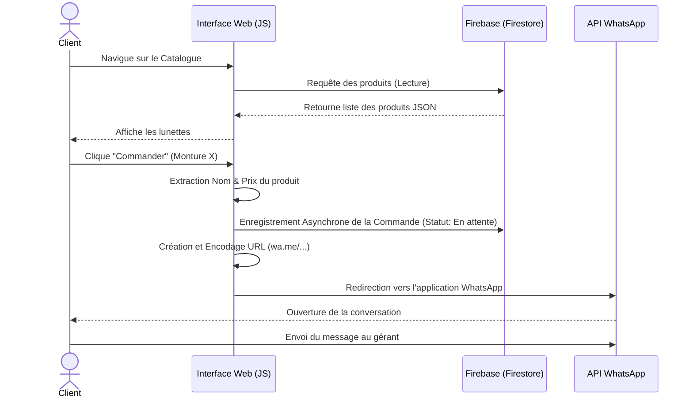
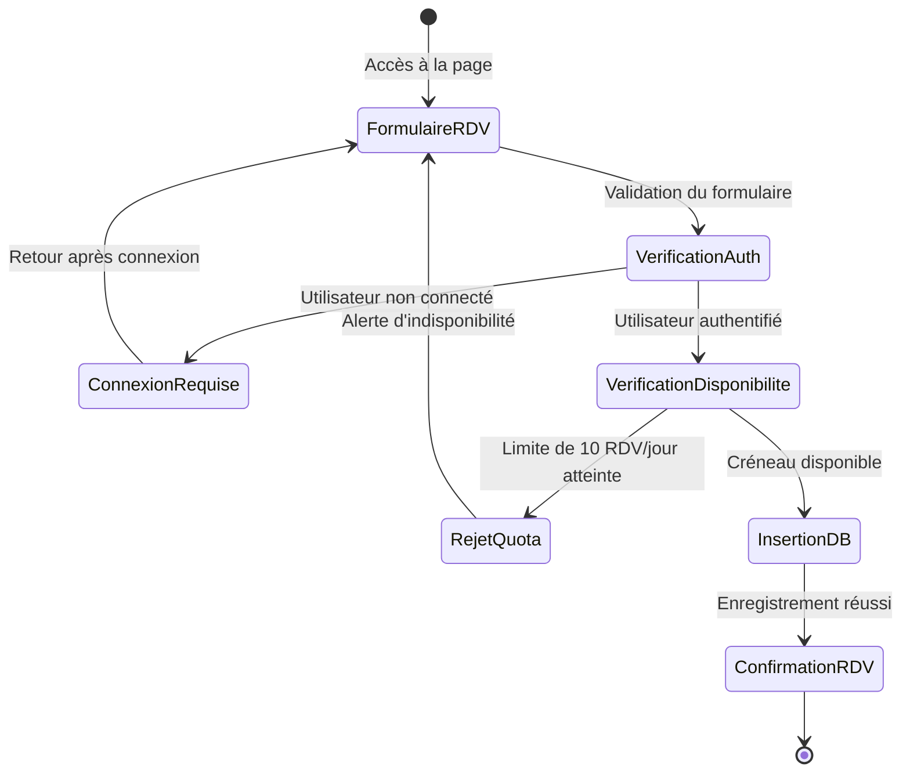
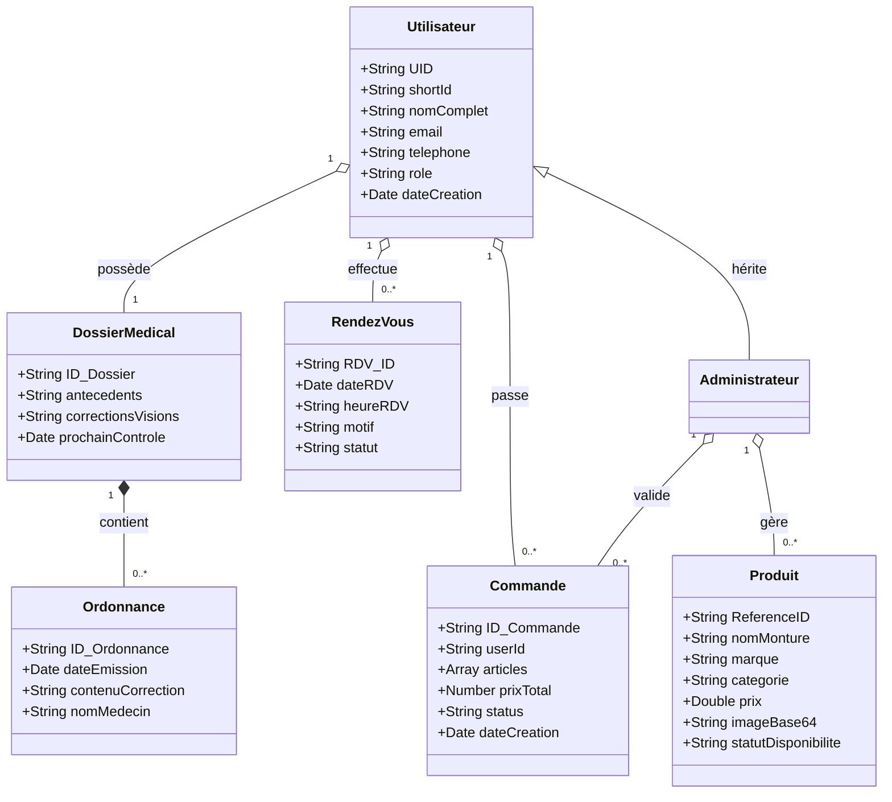
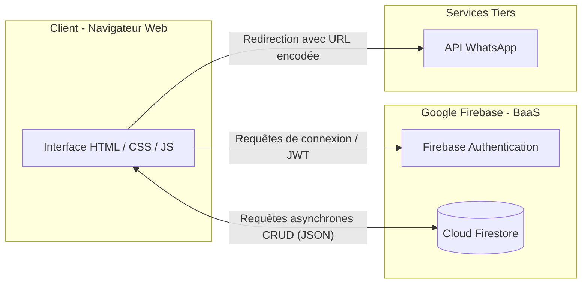
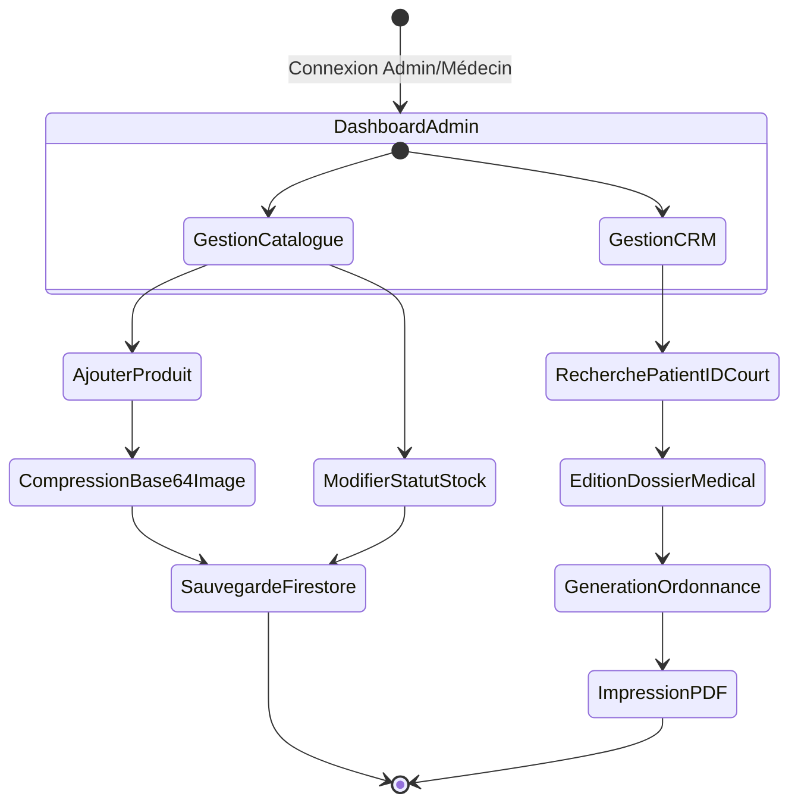

# INTRODUCTION GÉNÉRALE

L’évolution fulgurante des Technologies de l'Information et de la Communication (TIC) a profondément bouleversé l’ensemble des secteurs d’activité à travers le monde. Aujourd'hui, l'intégration du numérique n'est plus perçue comme un simple avantage concurrentiel, mais plutôt comme une nécessité vitale pour la pérennité et la croissance des entreprises. Ce phénomène de transformation digitale a donné naissance au commerce électronique (e-commerce), un modèle économique permettant aux entreprises d'abolir les barrières géographiques, de rester accessibles 24 heures sur 24, et d'offrir une expérience utilisateur personnalisée. 

Le secteur de l'optique et de la lunetterie n'échappe pas à cette révolution numérique. Longtemps considéré comme un domaine exclusivement limité aux points de vente physiques pour des raisons inhérentes aux essayages et aux examens de la vue, ce secteur entame une transition technologique majeure. Les patients et clients modernes, de plus en plus connectés, exigent désormais des processus simplifiés, qu'il s'agisse de la prise de rendez-vous médicaux, de la consultation des différents modèles de montures, ou de l'acquisition de verres correcteurs. C'est dans cette dynamique alliant le domaine de la santé visuelle et le commerce de détail que s'inscrit le présent projet.

L'entreprise **Barham Optic**, spécialisée dans la vente de lunettes et la prestation de services optiques, fait face à de nouveaux défis liés à la gestion de sa clientèle et de ses produits. Jusqu'à présent, le fonctionnement de la boutique reposait sur un modèle de gestion traditionnel : accueil physique des clients pour la consultation des catalogues, appels téléphoniques pour les prises de rendez-vous, et gestion manuelle des stocks et des commandes. Bien que fonctionnelle à petite échelle, cette méthode révèle de nombreuses limites, notamment des engorgements en salle d'attente, des rendez-vous parfois mal synchronisés, une visibilité réduite du catalogue de produits pour les clients distants, et un temps de gestion administratif chronophage pour le personnel.

Face à ces constats, une **problématique** centrale se dégage : *Comment Barham Optic peut-elle moderniser la gestion de son activité, optimiser l'accueil de ses patients et accroître sa visibilité commerciale grâce aux outils du développement web moderne ?*

### 2. Objectifs de l’étude
**Objectif Principal :** Concevoir, développer et déployer une plateforme web dynamique pour digitaliser les activités de Barham Optic, couplée à un système de gestion de la relation client (CRM).
**Objectifs Spécifiques :**
*   Digitaliser le catalogue (Verres, Collections, Solaires) avec un système de filtres multicritères.
*   Automatiser la prise de rendez-vous avec des quotas journaliers.
*   Implémenter un historique médical complet (Dossier Patient) doté d'un outil de recherche intelligent par identifiant court (N° de dossier), et permettre la génération d'ordonnances médicales dynamiques et imprimables pour le médecin et le patient.
*   Intégrer un système de commande fluide via l'API WhatsApp.
*   Développer un espace d'administration (Dashboard) pour la gestion autonome des stocks et de la patientèle.

Pour mener à bien et structurer ce travail, nous avons opté pour la méthode **UML (Unified Modeling Language)** pour la phase d'analyse et de conception, ainsi que pour un stack technologique moderne incluant le langage JavaScript, HTML5, CSS3, et l'écosystème Cloud **Google Firebase** comme infrastructure Backend-as-a-Service (BaaS).

Afin de restituer fidèlement la démarche conceptuelle et technique adoptée tout au long de la réalisation de ce projet d'étude, ce mémoire s'articulera autour de cinq chapitres principaux :

Le **premier chapitre** sera consacré au contexte général et à l'étude préalable. Nous y présenterons l'entité Barham Optic, ferons une analyse de la situation existante, pour ensuite en déduire le cahier des charges fonctionnel et non fonctionnel de la nouvelle application.

Le **deuxième chapitre** abordera la phase d'analyse et de modélisation du système. En nous appuyant sur le formalisme UML, nous détaillerons les différents cas d'utilisation, les scénarios d'interaction, et la modélisation de notre base de données.

Dans le **troisième chapitre**, nous justifierons nos choix d'architecture applicative et les divers outils technologiques retenus, tant du côté de l'interface utilisateur (Front-end) que du côté du serveur et de l'hébergement des données (Back-end).

Le **quatrième chapitre** constituera le cœur technique de notre rapport : l'implémentation et la réalisation. Il s'agira de présenter l'ergonomie des interfaces (UI/UX) et le fonctionnement concret des modules essentiels développés, en s'appuyant sur des extraits de code et des captures d'écran du site "Barham-Optic".

Enfin, le **cinquième et dernier chapitre** traitera des phases ultimes de notre projet, à savoir la stratégie de tests mise en œuvre pour garantir la viabilité du code, les étapes de déploiement, et nous exposerons les perspectives d'évolution futures pour la plateforme.

Le mémoire s'achèvera par une conclusion générale qui viendra faire le bilan des compétences acquises et des résultats obtenus au cours de ce projet de développement informatique.


---


# CHAPITRE 1 : CONTEXTE ET ÉTUDE PRÉALABLE

## 1.1 Présentation du cadre de l'étude (Barham Optic)

L’entreprise étudiée dans le cadre de ce mémoire est « Barham Optic », un cabinet et une boutique spécialisée dans les services d'optique-lunetterie. Barham Optic s'est donnée pour mission principale d’accompagner ses patients dans la préservation et l'amélioration de leur capital visuel. Son offre de services est diversifiée : vente de montures optiques et de lunettes de soleil, conseil en visagisme, commercialisation de lentilles de contact, et orientation vers des spécialistes pour des examens de la vue approfondis. 

Le personnel du cabinet est de taille humaine, composé à l'origine d’un opticien qualifié, épaulé d’assistants commerciaux chargés de l'accueil et de l'orientation de la clientèle. La force de l'entreprise repose sur son relationnel de proximité et la qualité du conseil prodigué. Cependant, avec l'accroissement progressif de sa base de clientèle ces dernières années et les nouvelles habitudes de consommation nées de la digitalisation, Barham Optic a ressenti le besoin de repenser sa stratégie d'approche et de fidélisation de sa clientèle.

## 1.2 Étude de l'existant

Avant de proposer une solution technologique, il est indispensable de comprendre et d'analyser la manière dont s'organise le travail actuel (le système existant) au sein de la boutique. Historiquement, le fonctionnement de Barham Optic s'appuie sur des méthodes d’organisation traditionnelles qui se déroulent entièrement en présentiel ou par échanges téléphoniques.

**La gestion des rendez-vous :** 
Toute demande de consultation ou d'assistance passe obligatoirement par un appel au secrétariat ou par une visite directe en boutique. Les employés utilisent un agenda papier (ou un fichier Excel basique) pour consigner les noms, heures et dates de présence des patients. 

**La consultation du catalogue de produits :**
Les clients désireux d’acheter de nouvelles lunettes doivent se déplacer physiquement en magasin pour voir les collections ("Verres", "Montures", etc.). L'opticien présente les échantillons disponibles sur ses présentoirs. Les informations concernant les stocks et les prix sont souvent retenues de mémoire par l'artisan ou consignées dans des registres physiques.

**La gestion des commandes et le SAV :**
L'interaction client-boutique s'achève souvent sitôt que le client sort du magasin. Pour d'éventuelles commandes sur mesure ou pour informer un client que ses lunettes sont prêtes, le gestionnaire recourt aux appels téléphoniques individuels, ce qui draine énormément de temps administratif.

## 1.3 Critique de l'existant

L’analyse de ces processus traditionnels fait ressortir plusieurs limites majeures qui entravent la croissance et la productivité de Barham Optic.

**Au niveau de la prise de rendez-vous :**
*   **Risque d'erreurs humaines :** Les doubles réservations ou les oublis sont monnaie courante, entraînant l’engorgement de la salle d'attente et l'insatisfaction des clients.
*   **Manque d'autonomie pour le client :** Le patient ne peut pas planifier son rendez-vous en dehors des heures d’ouverture de la boutique.

**Au niveau de l'expérience d'achat et du catalogue :**
*   **Rayonnement géographique limité :** L'absence d'une vitrine numérique implique que seuls les habitants du quartier ou les passants connaissent la diversité du catalogue.
*   **Déperdition d'informations :** Face à un client indécis, l'absence d'un catalogue en ligne l’empêche de réfléchir sereinement chez lui en parcourant les montures avant de se décider.

**Au niveau administratif :**
*   **Centralisation rudimentaire :** L'absence d'une base de données informatisée rend fastidieuse la recherche de l'historique d'un patient et l'inventaire des produits (les lunettes en rupture de stock sont souvent constatées au dernier moment devant le client).

Devant ces lacunes, le passage d'une gestion manuelle à un **système de gestion informatisé** s'est imposé comme une réponse impérative pour garantir la pérennité et le développement des activités du cabinet.

## 1.4 Le Cahier des charges

Le cahier des charges représente la pierre angulaire de notre projet. Il s'agit du document de référence qui traduit les attentes et les exigences de Barham Optic en spécifications informatiques claires que nous, en tant que développeurs, devons implémenter. Ce cahier des charges a été subdivisé en deux parties distinctes : les besoins fonctionnels et les besoins non-fonctionnels.

### 1.4.1 Besoins fonctionnels
Les besoins fonctionnels décrivent avec précision ce que le système (l'application web) doit être capable de faire. Les actions recensées sont les suivantes :

1.  **Gestion et Affichage du catalogue public :**
    *   Le système doit afficher la liste des lunettes disponibles réparties par type et par cible (Homme, Femme, Enfant, Mixte).
    *   Les clients doivent pouvoir filtrer les produits, rechercher par nom ou par marque et visualiser le détail de chaque article.
2.  **Panier et Commande (Intégration WhatsApp) :**
    *   Le client doit pouvoir sélectionner un produit et déclencher un processus de commande.
    *   La validation de la commande doit rediriger le client vers l'application WhatsApp de l'opticien avec un message pré-généré contenant les références du produit sélectionné, simplifiant ainsi le processus d'achat.
3.  **Gestion des rendez-vous en ligne :**
    *   Le système doit permettre à un client de sélectionner une date et une heure pour prendre un rendez-vous (consultation, réparation, achat).
    *   Le système doit instaurer des garde-fous limitant le nombre de rendez-vous quotidiens (par exemple, pas plus de 10 rendez-vous par jour) afin de ne pas surcharger l'opticien.
4.  **Espace Profil et Authentification (Client) :**
    *   Les utilisateurs devront pouvoir créer un compte, se connecter et se déconnecter de manière sécurisée.
    *   Le client doit pouvoir accéder à son "Espace Personnel" pour consulter l'historique de ses rendez-vous, mais aussi pour visualiser et imprimer ses ordonnances optiques de n'importe où.
5.  **Administration centralisée et CRM Médical (Dashboard Admin/Médecin) :**
    *   Un espace réservé (Dashboard) doit exister pour la gestion complète de la boutique et du cabinet.
    *   **Volet Boutique :** L'administrateur doit posséder les droits de création, de lecture, de modification et de suppression (CRUD) sur le catalogue et gérer la disponibilité des stocks (En stock, Rupture, Masqué).
    *   **Volet Clinique :** Le médecin doit disposer d'un annuaire des patients (recherche par ID court), pouvoir éditer des dossiers médicaux complets et générer dynamiquement des ordonnances imprimables.

### 1.4.2 Besoins non-fonctionnels
Les besoins non-fonctionnels concernent les contraintes techniques, de performance et d'ergonomie qui qualifient le fonctionnement du système.

*   **Responsive Design (Ergonomie mobile) :** Une majorité de la clientèle naviguant sur mobile, l’interface de l'application devra impérativement s'adapter à toutes les résolutions d’écran (smartphones, tablettes, ordinateurs portables).
*   **Portabilité et Accessibilité :** Le site web doit fonctionner correctement sur les différents navigateurs modernes du marché (Chrome, Firefox, Safari, Edge) sans perte de qualité visuelle ou fonctionnelle.
*   **Ergonomie et Charte graphique :** L’interface doit être intuitive, élégante mais professionnelle. Le choix des couleurs et des typographies doit refléter la spécialité médicale et le côté "premium" de la lunetterie.
*   **Sécurité et Protection des Données :** L’accès au module d'administration doit être strictement restreint et crypté. Les mots de passe des utilisateurs devront être gérés de façon sécurisée (hachage complet), d'où le recours prévu à des services d'authentification prouvés plutôt qu'au développement d'une structure de sécurité depuis la base, vulnérable aux attaques de type injection SQL.
*   **Haut Niveau de Disponibilité et Optimisation des Coûts (FinOps) :** Le service sera hébergé sur le Cloud afin d'assurer un fonctionnement ininterrompu. L'architecture globale devra garantir une optimisation stricte des coûts, en évitant notamment la facturation liée à l'hébergement de fichiers médias lourds (images), grâce à un traitement intelligent des données côté client.

## 1.5 Démarche méthodologique adoptée

Pour la conception de cette solution web, nous nous sommes inspirés des **méthodologies agiles**. Concrètement, le développement ne s'est pas fait de manière linéaire (modèle en cascade classique où on attend la fin totale pour tout tester), mais de façon itérative. 

Nous avons scindé le projet en multiples tâches ou "sprints" :
1.  Le maquettage et le développement de la structure statique (HTML / CSS).
2.  L'intégration de la dynamique (JavaScript) pour le filtrage du catalogue.
3.  La conception de la base de données et l'installation du backend as a service (Firebase).
4.  Le raccordement des données dynamiques (Authentification, Rendez-vous, Panel Admin).

À la fin de chaque étape fondamentale, des tests manuels ont été effectués afin de valider et figer les fonctionnalités avant de passer aux intégrations plus complexes. Cette approche souple a permis d'adapter les besoins non-fonctionnels (le design en l'occurrence) au fur et à mesure que les retours visuels prenaient forme sur nos écrans.

*En guise de conclusion de ce chapitre, l’étude préalable de l'existant a confirmé l’urgence d'une refonte organisationnelle à travers la mise en service d'une plateforme web. La définition claire du cahier des charges étant complétée, le chapitre suivant s’attachera à l'analyse approfondie du système par l'application de la démarche de modélisation UML.*


---


# CHAPITRE 2 : ANALYSE ET MODÉLISATION DU SYSTÈME

Ce chapitre marque la transition entre l'expression des besoins élaborée dans le cahier des charges et la conception technique du projet. Il s'agit de définir l'architecture logique du système et ses interactions fonctionnelles de manière formelle. Pour y parvenir, nous nous appuyons sur le langage de modélisation UML.

## 2.1 Le choix du langage UML

UML, ou *Unified Modeling Language* (Langage de Modélisation Unifié), n'est pas un langage de programmation, mais un langage graphique et textuel standardisé utilisé dans la conception des logiciels orientés objet. 
Le choix d'UML pour l'analyse de l'application Barham Optic se justifie par sa capacité à offrir une représentation visuelle, claire et compréhensible aussi bien par les développeurs que par les acteurs non-techniques du projet. Les divers diagrammes d'UML (Structurels et Comportementaux) permettent d'appréhender toutes les facettes du système, depuis le recueil des spécifications utilisateurs jusqu'à la structuration de la base de données de notre back-end Firebase.

Dans la cadre de cette conception, nous avons identifié trois diagrammes vitaux : le diagramme de cas d'utilisation, le diagramme de séquence et le diagramme de classes.

## 2.2 Identification des acteurs du système

Avant de modéliser les processus, il est crucial d'identifier les entités (acteurs) qui interagiront avec notre futur portail web Barham Optic. Un acteur en UML représente un rôle joué par une entité externe au système (utilisateur humain ou un autre logiciel).
Nous avons répertorié deux acteurs principaux aux niveaux de privilèges bien distincts :

1.  **L'Utilisateur (Client / Patient) :** Il s'agit de l'internaute qui navigue sur la plateforme. Il peut avoir un profil "Visiteur Anonyme" pour consulter le catalogue, ou un profil "Client Connecté" qui l'autorise à prendre un rendez-vous et accéder à son historique.
2.  **L'Administrateur (Le Gérant) :** Il s'agit du personnel ayant les pleins pouvoirs sur le système via le "Dashboard". Il gère les produits mis en vitrine et régule les requêtes des clients.

*(Note : On peut également rajouter un acteur externe secondaire, le **Système API WhatsApp**, intervenant pour valider l'acheminement des commandes via la messagerie).*

## 2.3 Les Cas d'Utilisation (Use Cases)

Le diagramme des cas d'utilisation permet de structurer les besoins des utilisateurs et les fonctionnalités correspondantes du système, sans entrer dans la logique technique de développement.

**Figure 2 : Diagramme de cas d'utilisation global du système**
```mermaid
flowchart LR
    Client((Client))
    Admin((Administrateur))
    
    subgraph "Système Web Barham Optic"
        direction TB
        uc1([Consulter le catalogue])
        uc2([Filtrer les produits])
        uc3([Simulateur Avant/Après])
        uc4([S'inscrire / Se connecter])
        uc5([Prendre un rendez-vous])
        uc6([Commander (WhatsApp & Historique)])
        uc7([Gérer le catalogue CRUD])
        uc8([Gérer RDV et Dossiers Médicaux])
        uc9([Générer / Imprimer Ordonnances])
        uc10([Gérer / Valider les Commandes])
    end
    
    Client --> uc1
    Client --> uc2
    Client --> uc3
    Client --> uc4
    Client --> uc5
    Client --> uc6
    Client --> uc9
    
    uc5 -. "<<include>>" .-> uc4
    uc6 -. "<<extend>>" .-> uc4
    uc9 -. "<<include>>" .-> uc4
    
    Admin --> uc4
    Admin --> uc7
    Admin --> uc8
    Admin --> uc9
    Admin --> uc10
```

### Descriptions textuelles des Cas d'Utilisation majeurs :

Afin de ne laisser aucune place à l'ambiguïté, chaque cas d'utilisation majeur d'UML nécessite sa description textuelle. En voici deux exemples cruciaux pour Barham Optic :

**Cas d'utilisation : 01 "Prendre un rendez-vous"**
*   **Acteur principal :** Client / Patient
*   **Précondition :** Être authentifié sur la plateforme.
*   **Description du déroulement :**
    1. Le client navigue vers la page "Prendre un rendez-vous" (rendezvous.html).
    2. Le système présente le formulaire avec le choix du motif de la visite et un sélecteur de date.
    3. Le client sélectionne sa date, son heure, et soumet la demande.
    4. Le système (lié à Firebase) vérifie la contrainte stricte des limites de rendez-vous (ex: max 2/heure).
    5. Si la limite n'est pas atteinte, le rendez-vous est enregistré, et une notification de validation apparait.
*   **Post-condition :** La base de données héberge le nouveau créneau réservé, rattaché à l'UID du client.

**Cas d'utilisation : 02 "Gérer le catalogue (CRUD)"**
*   **Acteur principal :** Administrateur
*   **Précondition :** Posséder un compte administrateur et être connecté au Dashboard.
*   **Description du déroulement :**
    1. L'administrateur accède au panel d'administration (admin.html).
    2. Il sélectionne la fonction "Ajouter un produit".
    3. Il saisit les caractéristiques du nouveau modèle de lunettes (Nom, Marque, Cible/Catégorie, Prix) et téléverse une image depuis son appareil.
    4. À la soumission, le système compresse l'image en direct (conversion Base64) et enregistre ce code couplé aux données textuelles sur *Firestore*.
    5. Le catalogue front-end est instantanément rafraîchi pour tous les visiteurs.

## 2.4 Modélisation de la dynamique : Les Diagrammes de Séquences

Le diagramme de séquences est l'un des diagrammes comportementaux d'UML. Il permet de représenter les interactions et les messages échangés entre les objets ou acteurs d'un système selon un ordre chronologique.

### Diagramme de séquence du flux "Passer commande de lunettes"

**Figure 6 : Diagramme de séquence du flux "Passer commande via WhatsApp"**

*Analyse du déroulement :* Ce diagramme démontre l'efficience de l'architecture. Le serveur allège sa structure métier en déléguant la finalisation transactionnelle à l'API de messagerie cryptée WhatsApp.

### Diagramme d'activité du flux "Prise de rendez-vous sécurisée"

**Figure 4 : Diagramme d'activité du processus de prise de rendez-vous en ligne**


## 2.5 Modélisation des données (Diagramme de Classes métier)

L'architecture backend reposant sur *Google Firebase Firestore*, il ne s'agit pas d'une base de données relationnelle typique régie par le langage SQL, mais d'une base de données dite **NoSQL** orientée Documents. 
Dans Firestore, les tables sont appelées **Collections**, les enregistrements sont des **Documents**, et il n'y a pas de jointures strictes. 

Toutefois, modéliser notre dictionnaire de données sous forme de diagramme de classes UML métiers reste essentiel pour structurer correctement les informations dans ce format JSON-like.

**Figure 3 : Diagramme de classes métier (Modélisation Firestore)**


*Analyse de la structure des entités :*
Les objets manipulés par le système convergent vers la liaison naturelle entre le catalogue et la planification. Avec le NoSQL (Firebase), l'association "0..*" entre `Utilisateur` et `RendezVous` signifie qu'à l'implémentation, chaque objet *Rendez-vous* possèdera un attribut référençant l'UID (User ID) unique Firebase du client. 

Par cette modélisation, le système assure un maillage robuste de l'information permettant d'enrichir le profil historique (« Espace Profil ») du patient sans dupliquer inutilement des données sensibles.

---

*En conclusion de ce deuxième chapitre, la norme UML a permis une formalisation de haut niveau du système cible. Les besoins recensés ont été transformés en processus interactionnels précis et la structure de la base d'informations a été dégagée. Sur ces bases analytiques structurées, le chapitre suivant justifiera l'adoption de l'architecture technique (Backend as a Service, Front-end interactif) en adéquation avec ces modèles.*


---


# CHAPITRE 3 : ARCHITECTURE ET CHOIX TECHNOLOGIQUES

La phase de modélisation et d'analyse ayant déterminé "ce que" le système doit faire, il est désormais question d'exposer "comment" il a été réalisé. Ce troisième chapitre est consacré à la présentation de l'architecture logicielle retenue pour l'application Barham Optic, ainsi qu'aux justifications des choix des différents langages, frameworks et outils de développement.

## 3.1 Architecture du système (Modèle "Serverless" et BaaS)

Historiquement, le développement d'applications web reposait sur une architecture dite "Monolithique" ou "Client-Serveur Classique" (ex: Architecture LAMP ou MVC avec PHP/MySQL), où le développeur devait configurer un serveur physique, écrire le code backend de routage et structurer une base de données relationnelle complexe.

Pour le projet Barham Optic, nous avons opté pour un paradigme d'architecture plus moderne, flexible et moins coûteux en maintenance : le **BaaS (Backend-as-a-Service) sous une architecture dite "Serverless" (Sans serveur physique à gérer)**. 

Dans cette architecture distribuée :
1.  **Le Front-end (Côté Client)** embarque toute la logique d'affichage et l'intelligence de l'interface utilisateur. Il est exécuté directement par le navigateur de l'internaute.
2.  **Le Back-end (Côté Serveur)** est délégué à un fournisseur Cloud (en l'occurrence, Google) qui expose des API hyperscalables pour la gestion de l'authentification, la sauvegarde des informations et les requêtes à la base de données. 

Ce choix se justifie amplement : il a permis de concentrer les efforts de développement sur l'expérience utilisateur et les fonctionnalités métiers (filtres dynamiques, prise de rendez-vous), tout en bénéficiant de l'infrastructure robuste et sécurisée de Google pour l'hébergement des données sensibles des patients, sans se soucier de la maintenance des serveurs matériels.

**Figure 1 : Architecture fonctionnelle (Serverless/BaaS) de l'application web Barham Optic**


## 3.2 Choix technologiques de la couche Présentation (Front-end)

Pour concevoir l'interface du "Dashboard" et la "Vitrine Client", nous nous sommes appuyés sur les standards fondamentaux et universels du web, à savoir la troïka : HTML, CSS et JavaScript. Le choix délibéré de ne pas recourir à des frameworks lourds (comme React, Angular ou Vue.js) a été dicté par la volonté de conserver une application légère, rapide à charger, au code maîtrisé de bout en bout, et parfaitement adaptée à l'envergure du projet.

*   **HTML5 (HyperText Markup Language) :** Utilisé pour la structure sémantique des pages. L'utilisation des balises sémantiques HTML5 (`<header>`, `<nav>`, `<section>`, `<footer>`) a été privilégiée pour faciliter l'accessibilité web et améliorer le référencement naturel (SEO) du cabinet sur les moteurs de recherche.
*   **CSS3 (Cascading Style Sheets) :** Privilégié pour la mise en forme et le design graphique (Styling). Afin d'assurer un affichage adaptatif (Responsive Design) et optimal sur tous les supports (mobiles, tablettes, PC), nous avons massivement exploité les modules modernes  `CSS Flexbox` et `CSS Grid Layout`. Ce choix nous a évité de dépendre de bibliothèques CSS externes (comme Bootstrap) qui auraient alourdi inutilement le temps de chargement des pages.
*   **JavaScript (Vanilla JS) :** JavaScript classique, sans framework, a été utilisé pour dynamiser le comportement du côté client (DOM). Il a permis d'implémenter l'algorithme de filtrage multicritères des lunettes, d'animer les menus (menus hamburgers mobiles), d'interagir asynchronement avec la base de données Firebase et de traiter les contrôles de saisies sur le formulaire de rendez-vous avant la soumission au serveur.

## 3.3 Choix technologiques de la couche Données (Services BaaS)

L'écosystème **Google Firebase** a été sélectionné pour propulser le backend de l'application Barham Optic. Firebase offre un ensemble cohérent de services cloud optimisés et interconnectés.

1.  **Firebase Authentication :**
    La sécurité informatique étant un besoin non-fonctionnel prioritaire (notamment pour l'historique médical ou d'achat des patients), nous avons eu recours à ce module. Il gère de manière autonome la création des comptes (flux d'inscription), la connexion (Login), le hachage sécurisé des mots de passe, et la génération de tokens de session (JWT, JSON Web Tokens). Afin de fluidifier l'expérience utilisateur et d'éliminer les barrières à l'inscription, nous avons également intégré le protocole d'authentification OAuth 2.0 via Google (Google Sign-In), permettant aux visiteurs de se connecter en un clic avec leur compte existant sans avoir à mémoriser de mot de passe. Enfin, ce module différencie de manière sécurisée un client classique d'un utilisateur "Administrateur" autorisé à manipuler le catalogue.
2.  **Cloud Firestore (Base de données NoSQL) :**
    Au lieu d'utiliser une base SQL classique, nous avons implémenté Firestore, une base de données cloud orientée "Documents", très flexible. Elle permet d'enregistrer les données (les fiches des paires de lunettes, les informations des profils, et la liste des rendez-vous) sous un format JSON. L'atout majeur de Firestore est son système de requêtes en "temps réel". Ainsi, si l'administrateur ajoute une nouvelle monture solaire dans le système ou modifie un prix, l'information se met à jour instantanément sur l'écran des visiteurs connectés.
3.  **Hébergement optimisé et Gratuité (Approche FinOps) :**
    Il est impératif pour un jeune projet e-commerce de maîtriser ses coûts d'infrastructure. Afin d'éviter les tarifications liées à l'hébergement physique des fichiers médias via *Firebase Storage* et le passage obligatoire au "Forfait Blaze", le système mis en place intègre un algorithme de compression local via l'API HTML5 Canvas. Les images téléversées par l'administrateur (y compris depuis un smartphone) sont instantanément redimensionnées, compressées et converties en chaînes de caractères `Base64` côté client, avant d'être sauvegardées sous forme de texte directement dans la base de données Firestore. Ce choix d'architecture astucieux garantit un serveur dorsal robuste et 100% gratuit à long terme.

## 3.4 Intégration d'outils et Services Tiers (L'API WhatsApp)

L'application intègre une architecture applicative orientée services externes. L'un des piliers du succès commercial envisagé pour Barham Optic est la suppression des barrières à l'achat. 
Plutôt que de développer un système de paiement électronique complexe (nécessitant des déclarations bancaires lourdes et impliquant des frais transactionnels), nous avons fait le choix stratégique du **Social Commerce**, spécifiquement adapté au continent africain et très prisé par les internautes : l'utilisation de **l'API Wa.me (WhatsApp)**.

*Architecture de la solution Whatsapp :* Grâce à JavaScript, lorsqu’un utilisateur clique sur "Commander" depuis une fiche de lunettes, un script récupère les informations de l'objet ciblé (Nom, Marque, Prix), génère un message dynamique, le convertit au format d'URL standardisée, puis invoque l'API WhatsApp officielle qui s’ouvre directement sur le téléphone ou l'ordinateur du client. Le lien direct est alors établi entre le conseiller Barham Optic et le futur acheteur.

## 3.5 Environnement et Outils de Développement

La réalisation de l'application s'est appuyée sur les outils standards de l'industrie du développement :

*   **Visual Studio Code (VS Code) :** L'éditeur de code (IDE - Integrated Development Environment) principal, choisi pour sa légèreté et ses très nombreuses extensions facilitant le développement (Live Server, auto-complétion du code source HTML/CSS/JS).
*   **Git :** L'outil de versionning (contrôle de version) incontournable. Il a permis de suivre les différentes itérations du projet, de revenir sur des versions antérieures du code en cas de bugs bloquants, et d'assurer une sauvegarde sécurisée de l'activité de développement.
*   **Console Développeur (DevTools) / Postman :** Indispensables pour les phases de test, les DevTools de Google Chrome ont permis de débugger le code JavaScript et de valider, minute par minute, l'adaptabilité visuelle (Responsive) des interfaces créées.

---
*Après avoir justifié l'ossature architecturale et les langages permettant de bâtir le système informatique, le chapitre suivant, très applicatif, s’attellera à démontrer la traduction technique de ces choix en illustrant les interfaces et en explicitant le fonctionnement du code et de sa logique sous-jacente.*


---


# CHAPITRE 4 : IMPLÉMENTATION ET RÉALISATION

Ce chapitre constitue le cœur technique de notre travail de recherche et de développement. Il a pour but de présenter les résultats finaux de la plateforme *Barham Optic* et d'exposer de manière pragmatique les logiques de codage (algorithmes, scripts) qui animent les fonctionnalités majeures décrites dans le cahier des charges.

## 4.1 L'Interface Utilisateur (UI) et l'Expérience Client (UX)

L'aspect visuel de l'application a été pensé pour refléter le professionnalisme clinique d'un opticien, tout en adoptant les codes graphiques du commerce digital haut de gamme (minimalisme, clarté, aération du contenu). Une attention particulière a été portée à la **cohérence de la marque**, avec une standardisation des couleurs (notamment l'utilisation systématique de la couleur bleue "Barham Optic" pour les titres de sections comme "Contactez-nous" ou les messages de succès d'authentification). De plus, l'espace utilisateur a été renommé **"Mon Espace Personnel"** pour offrir un ton plus chaleureux et centré sur le patient. 

### 4.1.1 La page d'Accueil (index.html)
La page d'accueil est le point d'entrée principal. Elle se décompose en un "Hero Section" imposant, captant l'attention de l'utilisateur dès les premières secondes grâce à une image d'arrière-plan haute définition et un appel à l'action (Call-to-Action) clair l'invitant à découvrir nos collections. La structure de navigation (header) est épurée, et les titres sont scrupuleusement centrés pour assurer un équilibre visuel parfait. De plus, une logique JavaScript dynamique a été implémentée pour détecter automatiquement le dernier produit ajouté dans la base de données et lui apposer un badge "Nouveau" en vitrine, gardant ainsi la page d'accueil toujours vivante et attractive sans intervention manuelle.

> *(Conseil : Insérer ici une capture d'écran globale de la page d'accueil avec son menu de navigation)*
**Figure 4.1 : Page d'accueil présentant le Hero Section et la navigation primaire.**

### 4.1.2 La vitrine des produits, Collections et Verres
La présentation des produits a fait l'objet d'un soin particulier pour s'aligner sur les standards du e-commerce de luxe. Sur la page **Collections**, un *Lookbook Éditorial* a été mis en place en utilisant une disposition asymétrique de type "Masonry" (via la propriété CSS `column-count`). Cette disposition casse la monotonie des grilles traditionnelles et offre une expérience de navigation proche de celle d'un magazine de mode. Au survol des images, des micro-animations CSS interactives se déclenchent : un léger zoom de l'image, l'apparition d'un voile assombrissant, et la révélation fluide du nom de la marque (ex: Gucci, Cartier) ainsi que de l'icône Instagram, incitant fortement à l'engagement.

Du côté de la page **Verres**, l'expertise technique est mise en valeur par un comparateur interactif "Avant / Après". Grâce à des propriétés avancées de filtres CSS (`filter: blur(), sepia(), contrast()`), nous simulons visuellement les défauts optiques (éblouissements nocturnes, reflets, lumière bleue). Au simple survol de la souris par l'utilisateur, les filtres se désactivent avec une transition douce, simulant l'effet correcteur immédiat du verre optique, le tout accompagné par le glissement de badges d'état ("Avant" / "Après"). Cette approche pédagogique permet au client de comprendre visuellement le bénéfice de chaque traitement optique sans recourir à de longues explications textuelles.

La grille de la boutique (Nos Produits) affiche quant à elle les articles de manière adaptative via une structure "CSS Grid". Sur un grand écran (PC), les produits s'alignent sur trois ou quatre colonnes, favorisant la comparaison. Sur mobile, cette grille se réduit dynamiquement à une ou deux colonnes, évitant à l'utilisateur de devoir zoomer ou scroller horizontalement.

> *(Conseil : Insérer ici une capture d'écran du Lookbook de la page Collections et une capture du système Avant/Après de la page Verres)*
**Figure 4.2 : Interface du Lookbook asymétrique et démonstrateur interactif de traitements optiques.**

## 4.2 Côté Client : Implémentation de la vitrine dynamique

Bien que l'architecture repose sur des pages HTML brutes, le contenu de ces dernières est généré en temps réel par JavaScript, ce qui confère à la plateforme l'aspect d'une application mono-page (SPA) particulièrement réactive.

### 4.2.1 Récupération et Affichage depuis Firebase
Au chargement de la page `collections.html`, un script asynchrone est exécuté pour forger un lien avec la collection *Firestore* hébergeant nos "Produits". Pour chaque Document de la base de données reconnu, JavaScript manipule le Document Object Model (DOM) pour créer "à la volée" le code HTML (`div`, `img`, `h3`, `p`) correspondant à la lunette.

### 4.2.2 Algorithme de recherche et filtrage dynamique
L'une des grandes réussites de l'application est l'incorporation d'une barre de recherche multicritères et de filtres avancés. Pour éviter de multiplier les requêtes incessantes vers le serveur Google (qui engendreraient des coûts et des lenteurs), l'ensemble du catalogue est chargé une fois en mémoire côté client.
Lorsqu'un utilisateur tape le nom d’une marque ou sélectionne une fourchette de prix, un *Listener* JavaScript détecte le changement d’état et applique immédiatement une méthode `.filter()` sur le tableau des produits en mémoire, masquant (via la propriété CSS `display: none`) instantanément les articles non pertinents sans rechargement de la page.

### 4.2.3 Le Module E-commerce : Du Panier à l'Historique d'Achats
Lorsqu'un visiteur souhaite acquérir une sélection de lunettes repérées dans le catalogue, il clique sur le bouton de commande de son panier. Afin d'assurer un suivi commercial rigoureux tout en maintenant une proximité relationnelle, le système orchestre un processus en deux étapes asynchrones :
1. **Sauvegarde en Base de Données (Historique) :** Avant de quitter le site, le script vérifie l'authentification de l'utilisateur. S'il est connecté à son "Espace Personnel", le contenu du panier est sauvegardé de manière asynchrone dans une collection Firestore dédiée (`commandes`) avec le statut initial *"En attente"*. Cela permet au client de retrouver l'intégralité de son historique d'achats, le détail des lunettes et le montant total dépensé, directement sur son profil.
2. **Redirection API WhatsApp :** Le système formate ensuite un texte personnalisé reprenant le listing de la commande (URL Encoding), puis redirige l'utilisateur vers la messagerie WhatsApp de l'opticien pour finaliser l'échange.

**Exemple conceptuel du fonctionnement couplé (Firestore + WhatsApp) :**
```javascript
// 1. Sauvegarde asynchrone de la commande pour l'historique du profil
if (user) {
    await addDoc(collection(db, "commandes"), {
        userId: user.uid,
        date: serverTimestamp(),
        articles: cart,
        status: "En attente"
    });
}
// 2. Redirection vers WhatsApp pour discussion directe avec l'opticien
const message = "Bonjour Barham Optic, je souhaite commander : ...";
const urlWhatsApp = `https://wa.me/${numeroOpticien}?text=${encodeURIComponent(message)}`;
window.open(urlWhatsApp, '_blank');
```
Ce pont technique complexe mais invisible pour l'utilisateur permet de palier l'absence de passerelle de paiement bancaire, tout en offrant une expérience de suivi de commandes digne d'un grand site e-commerce traditionnel.

## 4.3 Le Module de Prise de Rendez-Vous

Gérer le flux physique en boutique était la genèse de ce projet informatique. Sur la page `rendezvous.html`, la gestion du trafic est prise en main.

L'utilisateur se voit afficher un formulaire standardisé (Date, Heure, Motif de la consultation, Note textuelle). Le véritable défi algorithmique se situe à la soumission du formulaire : il faut garantir de ne pas surbooker la journée de l'opticien.

### Logique de restriction et comptage
Lors de la validation, le script JavaScript interroge la collection Firestore dédiée aux "Rendez-vous" avec une clause `where()` filtrant les éléments par la date sélectionnée. Si la longueur du tableau des enregistrements renvoyés par la base de données est supérieure ou égale à la limitation imposée (ex: 10 consultations max/jour), l'insertion du nouveau document est bloquée et un message d'alerte notifie l'utilisateur de l'indisponibilité de cette date, tout en préservant le design (absence de crash bloquant).

> *(Conseil : Insérer ici une capture d'écran du petit formulaire de prise de rendez-vous)*
**Figure 4.3 : Interface de la réservation de rendez-vous client.**

## 4.4 Le CRM Médical et l'Impression d'Ordonnances

Conscient des besoins spécifiques d'un cabinet d'ophtalmologie ou d'optique, nous avons développé un module CRM complet baptisé **Espace Médecin**. Ce module remplace avantageusement les fiches papier.
*   **Identifiants Courts et Recherche :** Au lieu d'utiliser de longs identifiants Firebase (ex: "a7X9p2Lm..."), le système génère automatiquement un **Numéro de Dossier court** (#A7X9P2) à 6 caractères, facilitant la communication. Une barre de recherche réactive permet de filtrer instantanément les patients par nom ou numéro de dossier.
*   **Le Dossier Médical Structuré :** Le médecin peut éditer un dossier structuré en 11 sections cliniques allant des informations administratives aux recommandations cliniques et dates de prochain contrôle.
*   **Impression d'Ordonnance Dynamique :** Une fois le dossier renseigné, le système est capable de générer en un clic une **Ordonnance Médicale formatée pour l'impression A4**, reprenant automatiquement les données du patient, les diagnostics, l'âge et la correction visuelle. Ce document officiel est également accessible et imprimable par le patient depuis son propre **Espace Profil**.

## 4.5 L'Espace Administration (Le Dashboard)

L’indépendance du gérant face aux informaticiens a été assurée par la création de la page privée `admin.html`. Son accès est formellement encadré par des *Security Rules* paramétrées directement sur l'interface cloud Firebase : les requêtes de lecture globale ou de suppression refusent tout accès (erreur 403 Forbidden) dont le token UID (User ID) ne correspond pas à l'adresse administrateur validée.

Ce tableau de bord se distingue par son approche **CRUD (Create, Read, Update, Delete)** intuitive :
*   **Create (Créer) & Update (Modifier)** : Un formulaire interactif permet de renseigner les caractéristiques (Prix, Catégorie, Marque, Statut) et d'ajouter une image. Le script compresse cette image en direct (Base64) et met à jour Firestore instantanément.
*   **Gestion des Stocks & Disponibilité (Soft Delete)** : Plutôt qu'une suppression brute, l'administrateur gère un *Statut de Disponibilité* (En stock, Rupture de stock, Masqué). Un produit en "Rupture de stock" reste visible dans le catalogue public avec un badge rouge "Rupture de Stock" (créant un sentiment de rareté), tandis qu'un produit "Masqué" disparaît de la vitrine sans être effacé de la base de données. Le formulaire d'administration a été ajusté pour intégrer ce sélecteur de disponibilité.
*   **Suivi des Commandes E-commerce** : En complément du catalogue, un onglet dynamique permet au gérant de visualiser en temps réel l'ensemble des paniers validés par les clients. Par de simples boutons, l'administrateur peut modifier le statut de la commande de *"En attente"* à *"Validée"* puis *"Livrée"*. Ces changements d'états se répercutent instantanément sur le profil personnel du client.
*   **Gestion des Rendez-Vous (UI/UX Optimisée)** : L'interface permet le suivi infaillible des patients grâce à un tableau chronologique. Suite à une refonte complète du design, les actions (Confirmer, Annuler, etc.) sont présentées sous forme de boutons d'action ergonomiques et modernes, facilitant l'interaction rapide par l'administrateur.

> *(Conseil : Insérer ici une belle capture globale du dashboard administrateur en insistant sur le tableau des produits avec les statuts et le tableau de réservation)*
**Figure 8 : Tableau de bord de l'administration du cabinet Barham Optic.**

**Figure 5 : Diagramme d'activité côté administrateur (Boutique & CRM)**


---
*En guise de conclusion de ce chapitre, l’application Barham Optic est pleinement opérationnelle. Les processus cruciaux ont été codés, sécurisés, et l'interaction base de données est fluide. 
Pour achever le projet avec rigueur, le chapitre ultime se penchera sur les tests globaux effectués pour valider la robustesse du site développé et discutera des perspectives de son déploiement public.*


---


# CHAPITRE 5 : TESTS, DÉPLOIEMENT ET ÉVALUATION

La finalisation du développement du code n'implique pas la fin immédiate du projet informatique. Il est indispensable de procéder à des étapes rigoureuses de tests et de validation afin de s'assurer que la solution déployée est robuste, sécurisée, ergonomique, et répond scrupuleusement au cahier des charges initial.

## 5.1 Stratégie de tests et Synthèse

Le processus de vérification de l'application "Barham Optic" a reposé sur des scénarios de **tests fonctionnels et de compatibilité**, visant à traquer les bugs (débogage) avant la mise en production.

1.  **Tests de compatibilité (Cross-Browser & Cross-Device) :**
    Nous avons navigué sur l'application depuis divers navigateurs dominants (Google Chrome, Mozilla Firefox, Safari) et depuis des OS mobiles différents (Android et iOS). L'affichage HTML/CSS s'est avéré particulièrement résilient. Les dispositions flexbox et grid ont permis aux catalogues de lunettes de s'empiler logiquement sur petit écran de smartphone sans perte d'information.  
2.  **Tests fonctionnels des Formulaires et d'Authentification :**
    Nous avons testé la robustesse du système d'authentification. Les tentatives de création de compte avec des mots de passe trop courts ou des emails invalides ont été toutes rejetées avec succès par les règles native de *Firebase Auth*. Par ailleurs, le test du blocage du surbooking des rendez-vous a fonctionné : créer 10 fausses réservations à une même date bloque catégoriquement toute 11ème tentative.
3.  **Tests de Réservation et d'Ingérence Sécurité :**
    Nous avons testé la robustesse des requêtes Firestore. Lors de la prise de rendez-vous, nous avons résolu un défi majeur lié aux permissions (erreur de réseau/Permission Denied) en configurant finement les **Security Rules** de Firebase. Le système autorise désormais la lecture publique (`allow read: if true;`) des disponibilités horaires pour fluidifier la prise de rendez-vous, tout en interdisant catégoriquement toute modification, suppression ou accès global au catalogue par le biais de règles strictes réservées à l'administrateur. Les tentatives d'insertion non autorisées depuis l'URL `admin.html` ont été immédiatement rejetées avec succès.

## 5.2 Stratégie de Déploiement et Hébergement

L'ultime phase correspond publiquement à l'hébergement du site web. 
Bien que l’écosystème global repose sur Google Firebase pour la base de données, nous avons opté pour la plateforme **Vercel** pour l'hébergement du site front-end. Vercel est un service d'hébergement cloud de niveau production optimisé pour les applications web modernes. 

*   Le déploiement est automatisé via l'intégration continue (CI/CD) avec le dépôt **GitHub**. À chaque validation de code (commit), Vercel déploie instantanément la dernière version du site sur ses serveurs mondiaux (CDN).
*   L'avantage principal de cette plateforme réside dans sa simplicité de configuration, sa rapidité de déploiement, et l'obtention immédiate d'un certificat cryptographique de sécurité **SSL (HTTPS)**. Le site (accessible via le domaine *barham-optic.vercel.app*) s'ouvre donc en mode "Sécurisé" sans coût supplémentaire, rassurant ainsi grandement le futur cyber-client. De plus, la configuration des domaines autorisés dans Firebase Authentication a été mise à jour pour inclure ce domaine Vercel, assurant un fonctionnement fluide des connexions (Google et Email) en production.

## 5.3 Bilan du Projet et Difficultés rencontrées

L’application correspond aujourd'hui aux attentes et l’objectif principal est atteint : Barham Optic possède son écosystème numérique. Néanmoins, quelques défis de taille ont dû être relevés durant le cycle de développement :
*   **La gestion asynchrone (JavaScript) :** Gérer les requêtes Firebase (Promises) sous entendait d'attendre la réponse du serveur avant de dessiner les balises HTML. Une mauvaise synchronisation risquait de laisser des pages blanches au client. L'usage minutieux des protocoles modernes (`async / await`) a solutionné ce problème.
*   **L’ergonomie de l'Admin :** La plus grande difficulté fut paradoxalement de rendre le tableau de bord d'administration "simple". Il fallait condenser l'ensemble des pouvoirs d'un gestionnaire (produits, statistiques de rendez-vous) en une seule interface de bord non-intimidante pour un usager médical.

## 5.4 Perspectives de développement

Malgré un rendu pleinement satisfaisant, la transformation technologique n'est jamais figée. À court ou moyen terme, notre solution web pourrait accueillir plusieurs innovations décisives :
1.  **Le paiement bancaire certifié :** Pour le moment, l’achat s’initie concrètement via WhatsApp. L'objectif sera d'intégrer des processeurs de paiements automatisés (comme *Stripe* ou des *API Mobile Money régionales*) directement au cœur du site pour fermer totalement la boucle e-commerce.
2.  **L’essai en Réalité Augmentée (IA / 3D) :** Une évolution majeure consisterait à implémenter une bibliothèque JavaScript permettant au client, en activant sa webcam, de "tester virtuellement" la monture sur son propre visage avant de l'acheter. Un atout colossal dans l'optique lunetterie.

---

# CONCLUSION GÉNÉRALE

À l’aube d'une nouvelle ère dominée par le commerce en ligne et la centralisation numérique des services de santé, la modélisation et la conception d'un site web applicatif répond aux impératifs d'évolution de toute entreprise.

Le présent mémoire a retracé les étapes de conceptualisation et de réalisation du portail web pour Barham Optic. Partant du constat des défaillances liées à la méthode traditionnelle (agendas surchargés, gestion fastidieuse des stocks en local et limitation géographique), nous avons érigé un cahier des charges rigoureux aboutissant à la modélisation comportementale du système sous la terminologie universelle UML.

En recourant à des piliers technologiques ouverts et standards (JavaScript côté client) adossés à la puissance sécurisée du Cloud via Firebase, nous sommes parvenus à développer une interface esthétique, ergonomique et hautement fonctionnelle. Le cabinet médical Barham Optic bénéficie aujourd’hui d'une vitrine numérique pour exposer ses collections à l'échelle mondiale, et d'un outil d'administration puissant garantissant la prise autonome et encadrée des rendez-vous des patients.

À titre personnel, la conduite de ce projet fut extrêmement formatrice. Outre la consolidation des compétences acquises en programmation front-end et en architecture serveur (BaaS), ce travail nous a initiés à la gestion stricte du cycle de vie d'un développement, exigeant rigueur dans les tests et esprit de synthèse face aux imprévus techniques de l'authentification et de la manipulation base de données.

Si ce logiciel résout la problématique initiale de l'entreprise, il ouvre aussi la voie à de passionnantes opportunités d’extensions commerciales (essayage virtuel de montures en 3D, IA) pour hisser encore plus haut l’expérience d’achat des futurs patients de Barham Optic.

---

# BIBLIOGRAPHIE ET WEBOGRAPHIE

**Ressources Documentaires en ligne :**

1.  **MDN Web Docs (Mozilla Developer Network)** : Documentations de référence pour le front-end universel.
    *   *JavaScript Référence :* https://developer.mozilla.org/fr/docs/Web/JavaScript
    *   *Guides et standards sur CSS Grid Layout et Flexbox.*
2.  **Google Firebase Documentation Officielle** :
    *   *Cloud Firestore, Storage and Authentication Setup Guides.*
    *   URL: https://firebase.google.com/docs
3.  **W3Schools** :
    *   *HTML5 et CSS3 Tutoriels interactifs.*
    *   URL: https://www.w3schools.com/
4.  **WhatsApp Business API Reference** :
    *   *Click-to-chat implementation (Documentation de structuration de lien wa.me)*.
    *   URL: https://faq.whatsapp.com/

**Ouvrages et Conceptions (UML) :**
*   "UML 2 par la pratique : Études de cas et exercices corrigés" - Pascal Roques (Éditions Eyrolles).
*   Apprentissage de Modélisation du comportement avec les cas d'utilisation (Cours Académiques Logiciels).
